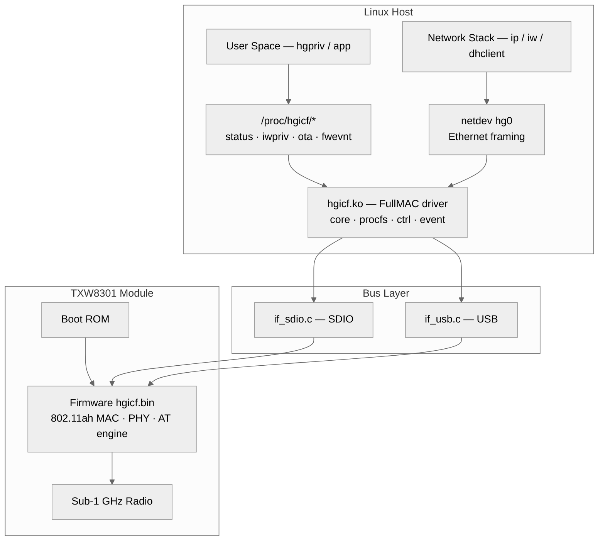
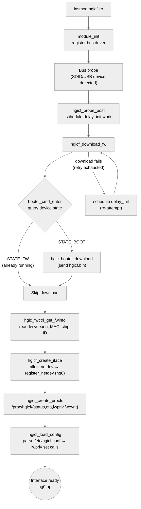
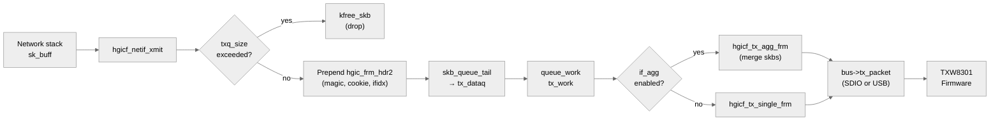
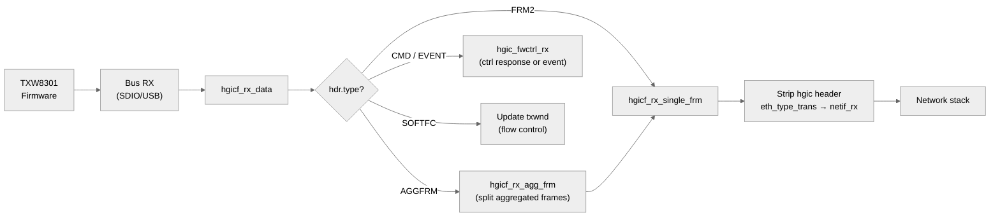
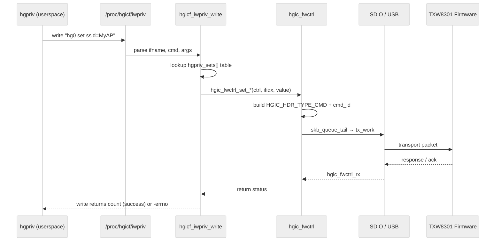
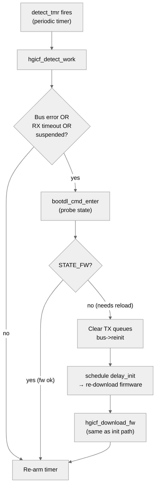

# TXW8301 FMAC Linux Driver (taixin-fmac-linux-driver)

This repository contains the TXW8301 FullMAC Linux driver stack and helper tools.

## Scope and Sources

This README is based on:

- Vendor guide V3.7, release date 2026-03-18: [doc/taixin_Linux_WiFi_FMAC_driver_development_guide_CN_v3.7/auto/taixin_Linux_WiFi_FMAC_driver_development_guide_CN_v3.7.md](doc/taixin_Linux_WiFi_FMAC_driver_development_guide_CN_v3.7/auto/taixin_Linux_WiFi_FMAC_driver_development_guide_CN_v3.7.md)
- Current driver implementation in this tree, especially:
  - [hgic_fmac/core.c](hgic_fmac/core.c)
  - [hgic_fmac/procfs.c](hgic_fmac/procfs.c)
  - [utils/iwpriv.c](utils/iwpriv.c)
  - [utils/if_sdio.c](utils/if_sdio.c)
  - [utils/if_usb.c](utils/if_usb.c)

When documentation and code differ, code behavior should be treated as authoritative.

## Version

- Driver package/SVN: `41305` (from [version.h](version.h))
- Recent kernel compatibility notes are tracked in [changelog.txt](changelog.txt)

## Architecture Overview

### System Block Diagram

Shows the FullMAC split: protocol stack runs on-module, host driver handles transport and control.



### Driver Initialization Flow

From `insmod` through firmware download to a working network interface.



### TX Path

Host network stack → driver → bus → module firmware.



### RX Path

Module firmware → bus → driver → host network stack.



### Control Command Path

How `hgpriv` set/get commands reach the firmware.



### Firmware Recovery (Detect & Re-init)

A periodic timer monitors firmware health and re-downloads if needed.



---

## What This Driver Provides

- FullMAC model: Wi-Fi protocol stack runs on module firmware (host does not run mac80211 stack for this device)
- Host interfaces:
  - SDIO
  - USB
- Runtime control interfaces:
  - `hgpriv` command path (via `/proc/hgicf/iwpriv`)
  - procfs status/event/OTA interfaces
- Optional helper APIs and demo apps under [tools/test_app](tools/test_app)

## Repository Layout

- [hgic_fmac](hgic_fmac): FMAC kernel driver (`hgicf.ko`)
- [utils](utils): bus/transport/control helpers (`if_sdio.c`, `if_usb.c`, iwpriv/fwctrl helpers)
- [tools/test_app](tools/test_app): host helper tools and API wrappers
- [doc](doc): vendor and project docs
- [ko](ko): output directory for built kernel modules

## Build

### Out-of-tree build (default workflow)

Edit toolchain/kernel path in [Makefile](Makefile), then run:

```bash
make fmac
```

Output:

- `ko/hgicf.ko`

Other useful targets (from [Makefile](Makefile)):

```bash
make fmac_usb
make fmac_sdio
make clean
```

### Build helper tools

```bash
./build_ahtool.sh
```

This builds and copies helper binaries into `bin/`.

## In-kernel tree integration (optional)

If integrating into a Linux source tree, follow [how_to_build_with_kernel.txt](how_to_build_with_kernel.txt):

1. Copy sources to `drivers/net/wireless/hugeic`
2. Use `Makefile.in` as in-tree makefile
3. Add `source "drivers/net/wireless/hugeic/Kconfig"` in wireless Kconfig
4. Add `obj-$(CONFIG_HGICF) += hugeic/` (or HGICS) in wireless Makefile
5. Enable in `menuconfig`

## Kernel/module prerequisites

From guide + code paths:

- Enable bus stack required by your platform:
  - SDIO: MMC/SD/SDIO and host driver
  - USB: USB host support
- Firmware loader support is required for runtime firmware fetch (`fw_file`, default `hgicf.bin`)
- For older kernels that fail on `mmc_card_disable_cd` symbol, see guidance in the V3.7 guide section and [utils/if_sdio.c](utils/if_sdio.c)

## Runtime loading

Typical insertion:

```bash
insmod hgicf.ko
```

Then configure interface (default name pattern is `hg%d`, usually `hg0`):

```bash
ip link set hg0 up
# Optional IP setup depending on your mode
```

## Module parameters (code-verified)

Defined in [hgic_fmac/core.c](hgic_fmac/core.c):

- `ifname` (charp, default `hg%d`): netdev naming pattern
- `conf_file` (charp, default `/etc/hgicf.conf`): config file or config directory
- `fw_file` (charp, default `hgicf.bin`): firmware file name
- `if_test` (int, default `0`): interface test mode
- `if_agg` (int, default `0`): aggregation size/enable behavior
- `txq_size` (int, default `1024`): host tx queue threshold
- `no_bootdl` (int, default `0`): skip normal boot download path
- `qc_mode` (int, default `0`): QC mode behavior
- `proc_dev` (int, default `0`): proc root naming mode

Example:

```bash
insmod hgicf.ko ifname=wlan%d conf_file=/etc fw_file=hgicf.bin
```

Notes:

- If `conf_file` contains `.conf`, driver reads that exact file.
- If `conf_file` is a directory, driver reads `<dir>/<ifname>.conf` (for multi-card use).

Reference implementation: `hgicf_load_config()` in [hgic_fmac/core.c](hgic_fmac/core.c)

## Config file format

Example defaults are provided in [hgicf.conf](hgicf.conf).

Each line is the right-hand side of a `hgpriv ... set` command, for example:

```text
chan_list=9080,9240,8
bss_bw=8
tx_mcs=255
key_mgmt=NONE
ssid=hgic_ah_test
mode=ap
```

Load order recommendation (guide-consistent):

1. Frequency/channel/bandwidth
2. Security (`key_mgmt`, `wpa_psk`)
3. Last: `mode`

## Control paths

### 1) hgpriv command path

The primary runtime command interface is through `hgpriv`/iwpriv wrappers.

Relevant files:

- [tools/test_app/hgpriv.c](tools/test_app/hgpriv.c)
- [tools/test_app/iwpriv.c](tools/test_app/iwpriv.c)
- kernel handler: [hgic_fmac/procfs.c](hgic_fmac/procfs.c)

The driver supports `set`, `get`, `scan`, and `save` command categories.

### 2) procfs path

Created by `hgicf_create_procfs()` in [hgic_fmac/procfs.c](hgic_fmac/procfs.c):

- `/proc/hgicf/status` (ro): firmware/runtime status
- `/proc/hgicf/ota` (rw): OTA trigger by writing firmware name
- `/proc/hgicf/iwpriv` (rw): driver command control channel
- `/proc/hgicf/fwevnt` (ro): event stream

If `proc_dev=1`, proc root uses netdev name instead of `hgicf`.

## Common bring-up sequence

1. Build driver (`make fmac`) and load module (`insmod hgicf.ko ...`)
2. Bring interface up
3. Apply configuration (`hgpriv hg0 set ...`), for example:

```bash
hgpriv hg0 set chan_list=9080,9160,9240
hgpriv hg0 set bss_bw=8
hgpriv hg0 set tx_mcs=255
hgpriv hg0 set key_mgmt=NONE
hgpriv hg0 set ssid=ah_test_ssid
hgpriv hg0 set mode=ap
```

4. Verify status:

```bash
cat /proc/hgicf/status
```

5. Observe events:

```bash
cat /proc/hgicf/fwevnt
```

## Event and state notes

Event IDs and connection states are defined in [hgic.h](hgic.h), including:

- `HGIC_EVENT_SCAN_DONE`
- `HGIC_EVENT_CONECTED`
- `HGIC_EVENT_DISCONECTED`
- `HGIC_EVENT_CONNECT_FAIL`
- `HGIC_EVENT_EXCEPTION_INFO`
- `HGICF_HW_CONNECTED = 9`

Guide-side interpretation/examples are in the V3.7 document section "驱动事件消息".

## Firmware loading and OTA

### Runtime firmware download

- Driver uses `fw_file` (default `hgicf.bin`) for boot download flow in [hgic_fmac/core.c](hgic_fmac/core.c)
- Place firmware in platform firmware search path (`/lib/firmware` is typical)

### OTA via procfs

```bash
echo -n firmware.bin > /proc/hgicf/ota
```

Code path: `hgicf_ota_send_data()` in [hgic_fmac/procfs.c](hgic_fmac/procfs.c)

## Troubleshooting (guide + code aligned)

### 1) Firmware not found

- Check kernel firmware loader support
- Check firmware search path for your platform
- Verify `fw_file` is file name only (no path)

### 2) USB cmd/data timeout during download

In some hosts, enabling zero-packet handling helps.

- Guide recommends adding `-DCONFIG_USB_ZERO_PACKET`
- Code path uses `CONFIG_USB_ZERO_PACKET` in [utils/if_usb.c](utils/if_usb.c)

### 3) SDIO download fails after data phase (cmd fail)

- Default SDIO boot download packet length is `32704` bytes in [utils/if_sdio.c](utils/if_sdio.c)
- For host limitations, reduce `bootdl_pktlen` (guide notes this scenario)

### 4) High kernel-version compatibility

Recent compatibility updates are tracked in [changelog.txt](changelog.txt), including support updates for newer kernels.

## Additional docs in this repository

- Main Chinese FMAC guide V3.7:
  - [doc/taixin_Linux_WiFi_FMAC_driver_development_guide_CN_v3.7/auto/taixin_Linux_WiFi_FMAC_driver_development_guide_CN_v3.7.md](doc/taixin_Linux_WiFi_FMAC_driver_development_guide_CN_v3.7/auto/taixin_Linux_WiFi_FMAC_driver_development_guide_CN_v3.7.md)
- Driver-focused companion docs:
  - [doc/TXW8301_FMAC-AT_COMMANDS-CHEATSHEET.md](doc/TXW8301_FMAC-AT_COMMANDS-CHEATSHEET.md)
  - [doc/TXW8301_FMAC-AT_COMMANDS-USER_GUIDE.md](doc/TXW8301_FMAC-AT_COMMANDS-USER_GUIDE.md)
  - [doc/TXW8301_FMAC-AT_IWPRIV_MAPPING.md](doc/TXW8301_FMAC-AT_IWPRIV_MAPPING.md)

## Maintainer notes

- Keep vendor baselines immutable outside designated development areas.
- For behavior disputes, verify in code first, then update docs with exact file references.
