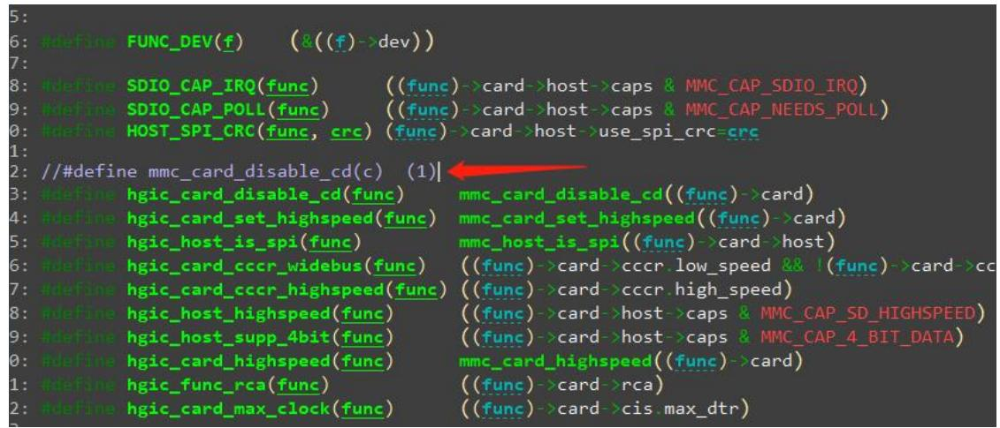
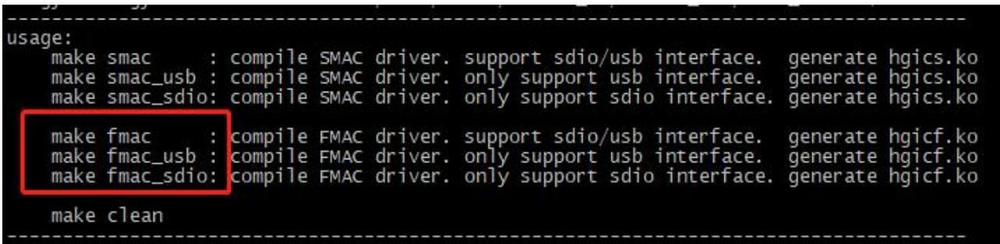
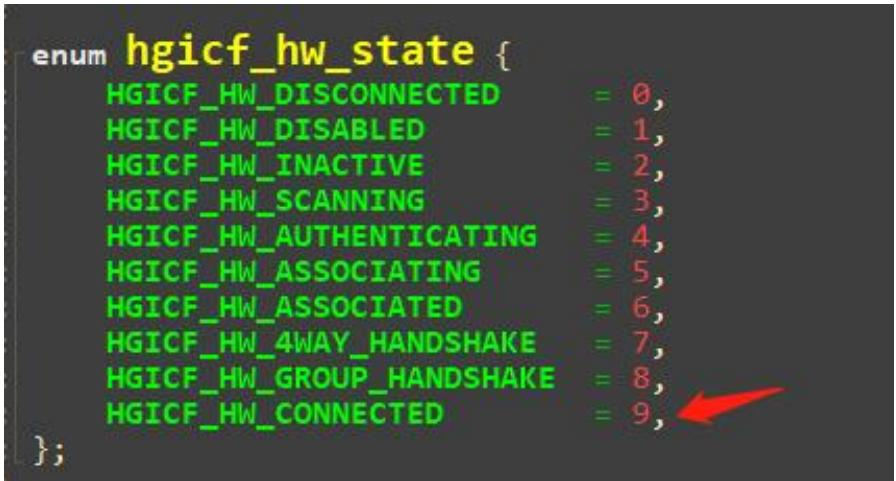
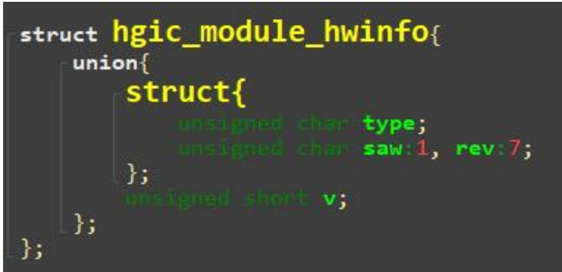
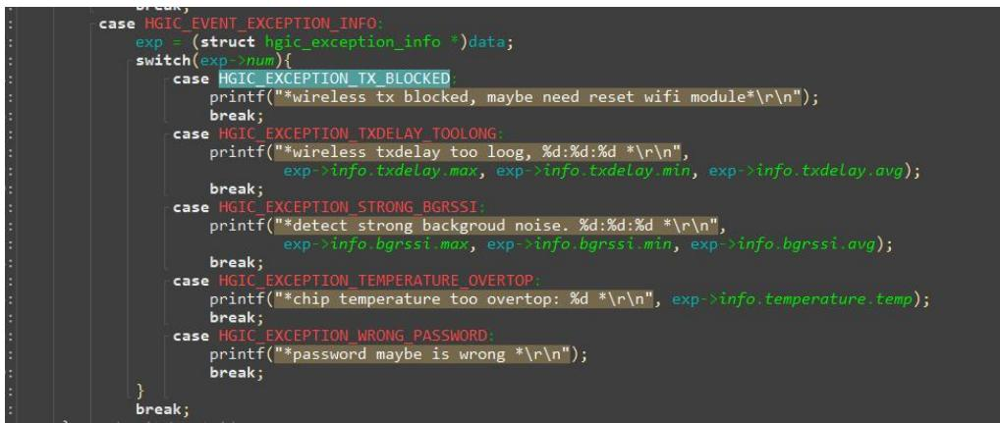
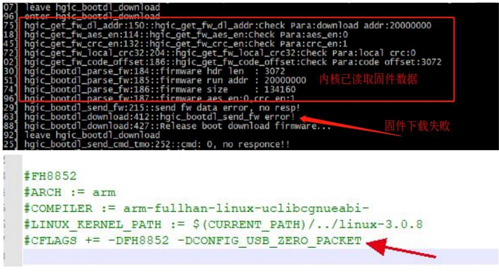
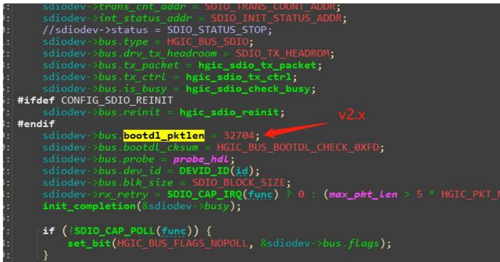
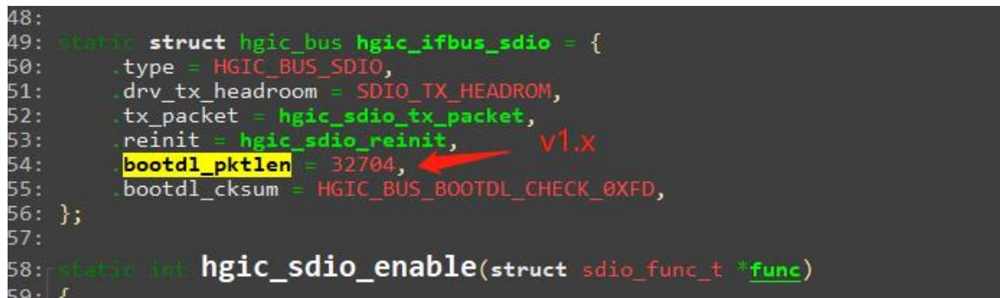
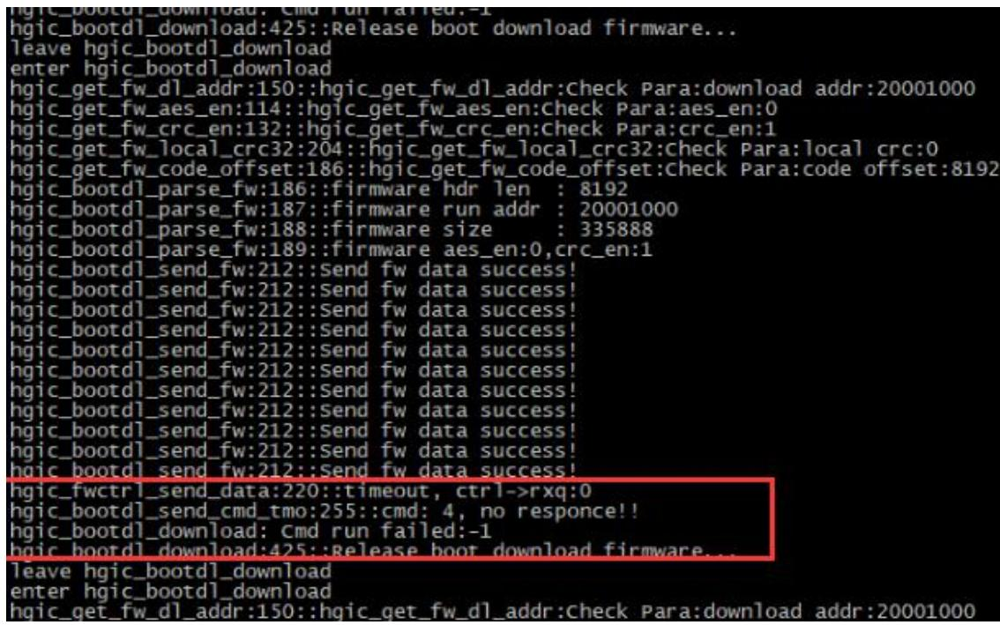

## 泰芯 Linux WiFi FMAC 驱动开发指南

# 泰芯半导体

Taixin Semiconductor

珠海泰芯半导体有限公司

TaiXin Semiconductor Co., Limited

珠海市高新区港湾一号科创园港11栋 3楼

<table><tr><td rowspan=1 colspan=1>保密等级</td><td rowspan=1 colspan=1>A</td><td rowspan=2 colspan=1>泰芯 Linux WiFi FMAC 驱动开发指南</td><td rowspan=1 colspan=1>文件编号</td><td rowspan=1 colspan=1></td></tr><tr><td rowspan=1 colspan=1>发行日期</td><td rowspan=1 colspan=1>2026/3/18</td><td rowspan=1 colspan=1>文件版本</td><td rowspan=1 colspan=1>V3.7</td></tr></table>

## 责任与版权

## 责任限制

本文档内容仅供参考。珠海泰芯半导体有限公司（以下简称“泰芯”）未对本文档信息的准确性或完整性作出任何明示或暗示的陈述或保证，且不对使用本文件信息所产生的后果承担任何责任。

泰芯保留在不另行通知对本文件进行修改、改进或其他变更的权利。

泰芯没有为客户产品的应用、设计验证提供协助的义务。客户应自行对其应用的设计、验证和测试负责，并确保其应用符合所有法律、法规及安全相关的要求。

如因客户未遵守本协议导致任何损害、费用、损失及/或责任，泰芯不承担任何责任；同时，客户应全额赔偿因客户未遵守本协议而给泰芯造成的任何损害、费用、损失及/或责任。

## 版权声明

未经泰芯书面同意，任何一方不得为商业目的修改、改编、变更、翻译或基于本文件创建衍生作品。

未经泰芯书面同意，任何一方不得向第三方披露或分发本文件中提及的任何部分或全部源代码、SDK、二进制文件和目标代码。

任何一方不得修改、反向工程、反汇编、反编译或以其他方式试图发掘任何非源代码部分的 SDK，包括但不限于预编译的二进制文件和目标代码。

此外，任何可能侵犯泰芯或其他知识产权所有者权利的行为也均被严格禁止。

对于实施上述侵权行为的主体，泰芯有权依据中华人民共和国法律或其他可能适用的法律、国际条约采取必要的法律措施，包括但不限于对侵权人提起诉讼或仲裁，或申请法律强制措施。

珠海泰芯半导体有限公司

2024 年 09 月 24 日

<table><tr><td rowspan="2">泰芯半导体 Taixin Semiconductor</td><td rowspan="2">珠海泰芯半导体有限公司 TaiXin Semiconductor Co., Limited</td><td rowspan="2">珠海市高新区港湾一号科创园港11栋3楼</td></tr><tr><td></td></tr><tr><td colspan="3">版权所有侵权必究</td></tr><tr><td colspan="3">Copyright © 2026 by TaiXin Semiconductor All rights reserved</td></tr></table>

修订记录
<table><tr><td></td><td rowspan=2 colspan=1>日期</td><td rowspan=2 colspan=2>版本</td><td rowspan=2 colspan=2>描述</td><td rowspan=2 colspan=1>修订人</td><td></td></tr><tr><td></td><td></td></tr><tr><td></td><td rowspan=1 colspan=1>2026/3/18</td><td rowspan=1 colspan=2>V3.7</td><td rowspan=1 colspan=2>修改 PS_MODE 的描述；</td><td rowspan=1 colspan=1>WY</td><td></td></tr><tr><td></td><td rowspan=1 colspan=1>2026/3/6</td><td rowspan=1 colspan=2>V3.6</td><td rowspan=1 colspan=2>修改AP低功耗的描述；</td><td rowspan=1 colspan=1>WY</td><td></td></tr><tr><td></td><td rowspan=1 colspan=1>2026/2/11</td><td rowspan=1 colspan=2>V3.5</td><td rowspan=1 colspan=2>增加 bgrssi 返回值的描述；增加 module_type 的描述;</td><td rowspan=1 colspan=1>WY</td><td></td></tr><tr><td></td><td rowspan=1 colspan=1>2026/1/21</td><td rowspan=1 colspan=2>V3.4</td><td rowspan=1 colspan=2>用hgpriv 进行参数配置的示例改用chan_list；</td><td rowspan=1 colspan=1>WY</td><td></td></tr><tr><td></td><td rowspan=1 colspan=1>2025/11/18</td><td rowspan=1 colspan=2>V3.3</td><td rowspan=1 colspan=2>增加断连原因描述；增加双天线只支持 STA 的描述；</td><td rowspan=1 colspan=1>WY</td><td></td></tr><tr><td></td><td rowspan=1 colspan=1>2025/10/31</td><td rowspan=1 colspan=2>V3.2</td><td rowspan=1 colspan=2>修改参数配置示例文件；</td><td rowspan=1 colspan=1>WY</td><td></td></tr><tr><td></td><td rowspan=1 colspan=1>2025/6/27</td><td rowspan=1 colspan=2>V3.1</td><td rowspan=1 colspan=2>修改 wakeup_io 的描述；修改 sysdbg 的描述；增加 get mode/key_mgmt/bss_bw;修改 set txpower 范围；修改 set tx_mcs 的描述；增加唤醒原因的说明；删除服务器保活命令里面设备型号的描述；修正字体；统一用这个文档来支持1.x和2.xSDK;</td><td rowspan=1 colspan=1>WY</td><td></td></tr><tr><td></td><td rowspan=1 colspan=1>2025/3/24</td><td rowspan=1 colspan=2>V3.0.1</td><td rowspan=1 colspan=2>修改 wpa_psk 的笔误；</td><td rowspan=1 colspan=1>WY</td><td></td></tr><tr><td></td><td rowspan=1 colspan=1>2025/2/26</td><td rowspan=1 colspan=2>V3.0</td><td rowspan=1 colspan=2>增加 SDK V2.x的相关描述；</td><td rowspan=1 colspan=1>WY</td><td></td></tr><tr><td></td><td rowspan=1 colspan=1>2024/8/12</td><td rowspan=1 colspan=2>V2.18.2</td><td rowspan=1 colspan=2>修改 super_pwr 描述的笔误;</td><td rowspan=1 colspan=1>WY</td><td></td></tr><tr><td></td><td rowspan=1 colspan=1>2024/6/20</td><td rowspan=1 colspan=2>V2.18.1</td><td rowspan=1 colspan=2>修改 get sta_list 的笔误；</td><td rowspan=1 colspan=1>WY</td><td></td></tr><tr><td></td><td rowspan=1 colspan=1>2024/5/5</td><td rowspan=1 colspan=2>V2.18</td><td rowspan=1 colspan=2>增加 dcdc13 的mode3 说明；</td><td rowspan=1 colspan=1>WY</td><td></td></tr><tr><td></td><td rowspan=1 colspan=1>2024/4/18</td><td rowspan=1 colspan=2>V2.17</td><td rowspan=1 colspan=2>增加 get signal 的接口；修改AP低功耗的说明（PS_mode4)；修改AP低功耗唤醒原因的说明；</td><td rowspan=1 colspan=1>WY</td><td></td></tr><tr><td></td><td rowspan=1 colspan=1>2024/2/8</td><td rowspan=1 colspan=2>V2.16</td><td rowspan=1 colspan=2>修改AP低功耗的说明；增加中继的描述；增加此文档仅支持1.xSDK的说明；</td><td rowspan=1 colspan=1>WY</td><td></td></tr><tr><td rowspan=1 colspan=3>泰芯半导体Taixin Semiconductor</td><td rowspan=1 colspan=2>珠海泰芯半导体有限公司TaiXin Semiconductor Co., Limited</td><td rowspan=1 colspan=3>珠海市高新区港湾一号科创园港11栋3楼</td></tr><tr><td rowspan=1 colspan=8>版权所有侵权必究Copyright © 2026 by TaiXin Semiconductor All rights reserved</td></tr></table>

<table><tr><td rowspan=1 colspan=1>保密等级</td><td rowspan=1 colspan=1>A</td><td rowspan=2 colspan=1>泰芯 Linux WiFi FMAC 驱动开发指南</td><td rowspan=1 colspan=1>文件编号</td><td rowspan=1 colspan=1></td></tr><tr><td rowspan=1 colspan=1>发行日期</td><td rowspan=1 colspan=1>2026/3/18</td><td rowspan=1 colspan=1>文件版本</td><td rowspan=1 colspan=1>V3.7</td></tr></table>

<table><tr><td rowspan=1 colspan=1>2023/12/8</td><td rowspan=1 colspan=1>V2.15</td><td rowspan=1 colspan=1>增加 superpwr=2 的说明；</td><td rowspan=1 colspan=1>WY</td></tr><tr><td rowspan=1 colspan=1>2023/11/29</td><td rowspan=1 colspan=1>V2.14.1</td><td rowspan=1 colspan=1>调整 country_region/scan/paired_stas的说明；</td><td rowspan=1 colspan=1>WY</td></tr><tr><td rowspan=1 colspan=1>2023/11/27</td><td rowspan=1 colspan=1>V2.14</td><td rowspan=1 colspan=1>增加 country_region 和修改 scan 命令；</td><td rowspan=1 colspan=1>ZEL</td></tr><tr><td rowspan=1 colspan=1>2023/10/3</td><td rowspan=1 colspan=1>V2.13</td><td rowspan=1 colspan=1>修改 wkreason 和reassoc_wkhost 的说明；</td><td rowspan=1 colspan=1>WY</td></tr><tr><td rowspan=1 colspan=1>2023/9/20</td><td rowspan=1 colspan=1>V2.12</td><td rowspan=1 colspan=1>修改ps_mode和 wakeup_io的说明；</td><td rowspan=1 colspan=1>WY</td></tr><tr><td rowspan=1 colspan=1>2023/9/3</td><td rowspan=1 colspan=1>V2.11</td><td rowspan=1 colspan=1>修改 pa_pwrctrl_dis 的说明；</td><td rowspan=1 colspan=1>WY</td></tr><tr><td rowspan=1 colspan=1>2023/8/31</td><td rowspan=1 colspan=1>V2.10</td><td rowspan=1 colspan=1>修改固件下载错误信息说明</td><td rowspan=1 colspan=1>DY</td></tr><tr><td rowspan=1 colspan=1>2023/7/28</td><td rowspan=1 colspan=1>V2.9</td><td rowspan=1 colspan=1>修改漫游的描述信息</td><td rowspan=1 colspan=1>DY</td></tr><tr><td rowspan=1 colspan=1>2023/5/23</td><td rowspan=1 colspan=1>V2.8</td><td rowspan=1 colspan=1>修改组播模式参数说明</td><td rowspan=1 colspan=1>WY</td></tr><tr><td rowspan=1 colspan=1>2023/5/17</td><td rowspan=1 colspan=1>V2.7</td><td rowspan=1 colspan=1>修改漫游接口说明</td><td rowspan=1 colspan=1>DY</td></tr><tr><td rowspan=1 colspan=1>2023/4/20</td><td rowspan=1 colspan=1>V2.6</td><td rowspan=1 colspan=1>增加 fwinfo 接口说明修改radio_onoff 接口说明</td><td rowspan=1 colspan=1>DY</td></tr><tr><td rowspan=1 colspan=1>2023/4/13</td><td rowspan=1 colspan=1>V2.5</td><td rowspan=1 colspan=1>增加 get conn_state 说明</td><td rowspan=1 colspan=1>DY</td></tr><tr><td rowspan=1 colspan=1>2023/4/7</td><td rowspan=1 colspan=1>V2.4</td><td rowspan=1 colspan=1>增加get bssid</td><td rowspan=1 colspan=1>DY</td></tr><tr><td rowspan=1 colspan=1>2023/4/6</td><td rowspan=1 colspan=1>V2.3</td><td rowspan=1 colspan=1>修改漫游的说明修改 superpwr 的笔误</td><td rowspan=1 colspan=1>WY</td></tr><tr><td rowspan=1 colspan=1>2023/3/7</td><td rowspan=1 colspan=1>V2.2.1</td><td rowspan=1 colspan=1>删除几个读命令的参数</td><td rowspan=1 colspan=1>WY</td></tr><tr><td rowspan=1 colspan=1>2023/2/17</td><td rowspan=1 colspan=1>V2.2</td><td rowspan=1 colspan=1>修复休眠和喚醒的描述添加 wakeup 命令描述</td><td rowspan=1 colspan=1>WY</td></tr><tr><td rowspan=1 colspan=1>2023/2/6</td><td rowspan=1 colspan=1>V2.1</td><td rowspan=1 colspan=1>增加 dtim和 autosleep 的描述增加 standby 参数的超链接</td><td rowspan=1 colspan=1>WY</td></tr><tr><td rowspan=1 colspan=1>2023/1/12</td><td rowspan=1 colspan=1>V2.0</td><td rowspan=1 colspan=1>初始版本</td><td rowspan=1 colspan=1>DY</td></tr></table>

<table><tr><td>泰芯半导体 Taixin Semiconductor</td><td>珠海泰芯半导体有限公司 TaiXin Semiconductor Co., Limited</td><td>珠海市高新区港湾一号科创园港11栋3楼</td></tr><tr><td colspan="3">版权所有侵权必究 Copyright © 2026 by TaiXin Semiconductor Al1 rights reserved</td></tr></table>

<table><tr><td rowspan=1 colspan=1>保密等级</td><td rowspan=1 colspan=2>A</td><td rowspan=1 colspan=7>泰芯LinuxWiFiFMAC 驱动开发指南</td><td rowspan=1 colspan=1>文件编号</td><td rowspan=1 colspan=1></td></tr><tr><td rowspan=1 colspan=1>发行日期</td><td rowspan=1 colspan=2>2026/3/18</td><td></td><td></td><td></td><td></td><td></td><td></td><td></td><td rowspan=1 colspan=1>文件版本</td><td rowspan=1 colspan=1>V3.7</td></tr><tr><td rowspan=21 colspan=6>调试命令.状态查询命令···…</td><td rowspan=1 colspan=2></td><td rowspan=1 colspan=1>hgpriv</td><td></td><td></td><td></td></tr><tr><td rowspan=1 colspan=3></td><td rowspan=1 colspan=2>hgpriv</td><td></td><td></td><td></td><td></td><td></td><td></td></tr><tr><td rowspan=1 colspan=2>hgpriv</td><td></td><td></td><td></td><td></td><td></td><td></td></tr><tr><td rowspan=1 colspan=1></td><td rowspan=1 colspan=2>hgpriv</td><td></td><td></td><td></td><td></td><td></td><td></td></tr><tr><td rowspan=1 colspan=1>8.</td><td rowspan=1 colspan=2>hgpriv</td><td rowspan=1 colspan=2>hg0 set</td><td></td><td></td><td></td><td></td></tr><tr><td rowspan=1 colspan=1>9.</td><td rowspan=1 colspan=2>hgpriv</td><td rowspan=1 colspan=2>hg0 set</td><td></td><td></td><td></td><td></td></tr><tr><td rowspan=1 colspan=4>10. hgpri</td><td rowspan=1 colspan=5>10. hgpriv hg0 set acs=1, 10..                                                        .7</td><td></td></tr><tr><td rowspan=1 colspan=5>.7</td><td></td></tr><tr><td rowspan=2 colspan=5>1. hgpriv hg0 set loaddef=0/1 .                                                       72. hgpriv hg0 set dbginfo=0/1 ...</td><td></td></tr><tr><td rowspan=1 colspan=2>hgpriv</td><td rowspan=1 colspan=2>hg0 set</td><td></td></tr><tr><td rowspan=1 colspan=1></td><td rowspan=1 colspan=2>hgpriv</td><td rowspan=1 colspan=2>hg0 set</td><td rowspan=1 colspan=4>3. hgpriv hg0 set sysdbg=type, 0/1/2 ..                                          .8</td></tr><tr><td rowspan=1 colspan=2>hgpriv</td><td rowspan=1 colspan=2>hg0 set</td><td></td><td></td><td></td><td></td></tr><tr><td rowspan=1 colspan=2>hgpriv</td><td rowspan=1 colspan=2>hg0 sca</td><td rowspan=1 colspan=4>.8</td></tr><tr><td rowspan=1 colspan=2>旬命令.</td><td rowspan=1 colspan=2></td><td></td><td></td><td></td><td></td></tr><tr><td rowspan=1 colspan=1></td><td rowspan=1 colspan=2>hgpriv</td><td rowspan=1 colspan=2>hg0 get</td><td rowspan=1 colspan=4>.9</td></tr><tr><td rowspan=1 colspan=2></td><td rowspan=1 colspan=2>hgpriv</td><td rowspan=1 colspan=2>hg0 get</td><td rowspan=1 colspan=4>.9</td></tr><tr><td rowspan=1 colspan=2></td><td rowspan=1 colspan=2>hgpriv</td><td rowspan=1 colspan=1>hg0</td><td rowspan=1 colspan=1>get</td><td rowspan=1 colspan=4>..10</td></tr><tr><td rowspan=1 colspan=2></td><td rowspan=1 colspan=2>hgpriv</td><td rowspan=1 colspan=1>hg0</td><td rowspan=1 colspan=1>get</td><td rowspan=1 colspan=4>10</td></tr><tr><td rowspan=1 colspan=2></td><td rowspan=1 colspan=2>hgpriv</td><td rowspan=1 colspan=2>hg0 get</td><td rowspan=1 colspan=4>10</td></tr><tr><td rowspan=1 colspan=2>hgpriv</td><td rowspan=1 colspan=2>hg0 get</td><td rowspan=2 colspan=4>1010</td></tr><tr><td rowspan=1 colspan=2>hgpriv</td><td rowspan=1 colspan=2>hg0 get</td></tr><tr><td rowspan=2 colspan=6></td><td rowspan=1 colspan=2>hgpriv</td><td rowspan=1 colspan=1>hg0 get</td><td rowspan=1 colspan=3>8. hgpriv hg0 get sta_list .................</td></tr><tr><td rowspan=1 colspan=6>9. hgpriv hg0 get scan_list .......</td></tr><tr><td rowspan=1 colspan=12>10. hgpriv hg0 get disassoc_reason ..                                            1111. hgpriv hg0 get bgrssi=chan_index ...12. hgpriv hg0 get bssid （仅 SDK V1.x支持）                                   1213. hgpriv hg0 get signal ....</td></tr><tr><td rowspan=1 colspan=5>泰芯半导体Taixin semiconductor</td><td rowspan=1 colspan=4>珠海泰芯半导体有限公司TaiXin Semiconductor Co., Limited</td><td rowspan=1 colspan=3>珠海市高新区港湾一号科创园港11 栋3楼</td></tr><tr><td rowspan=1 colspan=12>版权所有侵权必究Copyright © 2026 by TaiXin Semiconductor Al1 rights reserved</td></tr></table>

<table><tr><td rowspan=1 colspan=1>保密等级</td><td rowspan=1 colspan=3>A</td><td rowspan=1 colspan=7>泰芯Linux WiFiFMAC 驱动开发指南</td><td rowspan=1 colspan=1>文件编号</td><td rowspan=1 colspan=1></td></tr><tr><td rowspan=1 colspan=1>发行日期</td><td rowspan=1 colspan=3>2026/3/18</td><td></td><td></td><td></td><td></td><td></td><td></td><td></td><td rowspan=1 colspan=1>文件版本</td><td rowspan=1 colspan=1>V3.7</td></tr><tr><td rowspan=1 colspan=1></td><td rowspan=1 colspan=3></td><td></td><td></td><td></td><td></td><td></td><td></td><td></td><td></td><td></td></tr><tr><td rowspan=1 colspan=1></td><td rowspan=1 colspan=3></td><td></td><td></td><td></td><td></td><td></td><td></td><td></td><td></td><td></td></tr><tr><td rowspan=1 colspan=1></td><td rowspan=1 colspan=3></td><td></td><td></td><td></td><td></td><td></td><td></td><td></td><td></td><td></td></tr><tr><td rowspan=1 colspan=1></td><td rowspan=1 colspan=3></td><td rowspan=1 colspan=8>5. hgpriv hg0 set max_txcnt=xx ..</td><td></td></tr><tr><td rowspan=1 colspan=1></td><td rowspan=1 colspan=3></td><td rowspan=1 colspan=4>6. hgpriv hg0 set ap_hide=l .....</td><td rowspan=1 colspan=4></td><td></td></tr><tr><td rowspan=1 colspan=1></td><td rowspan=1 colspan=3></td><td rowspan=1 colspan=4>7. hgpriv hg0 set bss_max_idle=xx .</td><td rowspan=1 colspan=3>7. hgpriv hg0 set bss_max_idle=xx .</td><td rowspan=1 colspan=1></td><td rowspan=1 colspan=1>13</td></tr><tr><td></td><td></td><td></td><td></td><td></td><td></td><td></td><td></td><td rowspan=2 colspan=4>8. hgpriv hg0 set disassoc_sta=f8:de:09:96:8f:28.</td><td rowspan=1 colspan=2></td><td></td></tr><tr><td rowspan=1 colspan=1></td><td rowspan=1 colspan=3></td><td rowspan=1 colspan=4>hgpriv hg0 set</td><td rowspan=1 colspan=1>14</td></tr><tr><td rowspan=1 colspan=1></td><td rowspan=1 colspan=3></td><td rowspan=1 colspan=4>hgpriv hg0 set</td><td></td><td></td><td></td><td></td><td></td></tr><tr><td rowspan=1 colspan=1></td><td rowspan=1 colspan=3></td><td rowspan=1 colspan=4>hgpriv hg0 se</td><td></td><td></td><td></td><td></td><td></td></tr><tr><td rowspan=1 colspan=1></td><td rowspan=1 colspan=3></td><td></td><td></td><td></td><td></td><td></td><td></td><td></td><td></td><td></td></tr><tr><td rowspan=1 colspan=4></td><td rowspan=1 colspan=2>hgpriv</td><td rowspan=1 colspan=2>hg0 se</td><td></td><td></td><td></td><td></td><td></td></tr><tr><td rowspan=1 colspan=4></td><td rowspan=1 colspan=2>hgpriv</td><td rowspan=1 colspan=2>hg0 se</td><td></td><td></td><td></td><td></td><td></td></tr><tr><td rowspan=1 colspan=1></td><td rowspan=1 colspan=3></td><td rowspan=1 colspan=2>hgprid</td><td rowspan=1 colspan=2>hg0 se</td><td></td><td></td><td></td><td></td><td></td></tr><tr><td rowspan=1 colspan=1></td><td rowspan=1 colspan=3>低功耗相关参数.</td><td rowspan=1 colspan=2>低功耗相关参数.</td><td rowspan=1 colspan=2></td><td></td><td></td><td></td><td></td><td></td></tr><tr><td rowspan=1 colspan=1></td><td rowspan=1 colspan=3></td><td rowspan=1 colspan=4>1. hgpriv hg0 set sleep=1 .</td><td></td><td></td><td></td><td></td><td></td></tr><tr><td rowspan=1 colspan=1></td><td rowspan=1 colspan=2></td><td rowspan=1 colspan=1>2.</td><td rowspan=1 colspan=3>hgpriv hg0</td><td rowspan=1 colspan=1>set</td><td></td><td></td><td></td><td></td><td></td></tr><tr><td rowspan=2 colspan=3></td><td rowspan=1 colspan=1></td><td rowspan=1 colspan=2>hgpriv</td><td rowspan=1 colspan=1>hg0</td><td rowspan=1 colspan=1>set</td><td></td><td></td><td></td><td></td><td></td></tr><tr><td rowspan=1 colspan=1></td><td rowspan=1 colspan=2>hgpriv</td><td rowspan=1 colspan=1>hg0</td><td rowspan=1 colspan=1>set</td><td></td><td></td><td></td><td></td><td></td></tr><tr><td rowspan=8 colspan=3></td><td rowspan=1 colspan=3>5. hgpriv</td><td rowspan=1 colspan=1>hg0</td><td rowspan=1 colspan=1>set</td><td></td><td></td><td></td><td></td><td></td></tr><tr><td rowspan=1 colspan=3>6. hgpriv</td><td rowspan=1 colspan=1>hg0</td><td rowspan=1 colspan=1>set</td><td></td><td></td><td></td><td></td><td></td></tr><tr><td rowspan=1 colspan=3>7. hgpriv</td><td rowspan=1 colspan=1>hg0</td><td rowspan=1 colspan=1>get</td><td></td><td></td><td></td><td></td><td></td></tr><tr><td rowspan=1 colspan=3>8. hgpriv</td><td rowspan=1 colspan=1>hg0</td><td rowspan=1 colspan=1>set</td><td rowspan=1 colspan=5>19</td></tr><tr><td rowspan=1 colspan=3>9. hgpriv</td><td rowspan=1 colspan=1>hg0</td><td rowspan=1 colspan=1>set</td><td rowspan=1 colspan=5>9. hgpriv hg0 set pa_pwrctl_dis=xx .                                             19</td></tr><tr><td rowspan=1 colspan=3>10. hgpriv</td><td rowspan=1 colspan=1>hg0</td><td rowspan=1 colspan=1>set</td><td rowspan=1 colspan=4>20</td><td></td></tr><tr><td rowspan=1 colspan=1>11.</td><td></td><td rowspan=1 colspan=1>hgpriv</td><td rowspan=1 colspan=1>hg0</td><td rowspan=1 colspan=1>set</td><td rowspan=1 colspan=4>11. hgpriv hg0 set autosleep_time=xx ..                                        20</td><td></td></tr><tr><td rowspan=1 colspan=3>12. hgpriv</td><td rowspan=1 colspan=1>hg0</td><td rowspan=1 colspan=1>set</td><td rowspan=1 colspan=4>12. hgpriv hg0 set wait_psmode=0/1 .                                             20</td><td></td></tr><tr><td rowspan=2 colspan=3></td><td rowspan=1 colspan=1>13.</td><td></td><td rowspan=1 colspan=1>hgpriv</td><td rowspan=1 colspan=1>hg0</td><td rowspan=1 colspan=1>set</td><td rowspan=1 colspan=4>13. hgpriv hg0 set ps_connect=60, 4..                                             21</td><td></td></tr><tr><td rowspan=1 colspan=3>14. hgpriv</td><td rowspan=1 colspan=1>hg</td><td rowspan=1 colspan=1>set</td><td rowspan=1 colspan=4>21</td><td></td></tr><tr><td rowspan=1 colspan=3></td><td rowspan=1 colspan=1>15.</td><td></td><td rowspan=1 colspan=1>hgpriv</td><td rowspan=1 colspan=1>hg0</td><td rowspan=1 colspan=1>set</td><td rowspan=1 colspan=4>15. hgpriv hg0 set standby=chn_idx, wakeuptime ..............</td><td></td></tr><tr><td rowspan=2 colspan=3></td><td rowspan=1 colspan=1>16.</td><td></td><td rowspan=1 colspan=1>hgpriv</td><td rowspan=1 colspan=1>hg0</td><td rowspan=1 colspan=1>set</td><td rowspan=1 colspan=4>22</td><td></td></tr><tr><td rowspan=1 colspan=2>17.</td><td rowspan=1 colspan=1>hgpriv</td><td rowspan=1 colspan=1>hg0</td><td rowspan=1 colspan=1>set</td><td rowspan=1 colspan=4>17. hgpriv hg0 set wkdata_save=1                                                 22</td><td></td></tr><tr><td rowspan=2 colspan=3></td><td rowspan=1 colspan=2>18.</td><td rowspan=1 colspan=2>hgpriv hg0</td><td rowspan=1 colspan=1>set</td><td rowspan=1 colspan=4>18. hgpriv hg0 set heartbeat=ip_str, port, hb_interval, hb_tmo ...       22</td><td></td></tr><tr><td rowspan=1 colspan=2>19.</td><td rowspan=1 colspan=2>hgpriv hg0</td><td rowspan=1 colspan=1>set</td><td rowspan=1 colspan=4>19. hgpriv hg0 set heartbeat_resp .....                                          22</td><td></td></tr><tr><td rowspan=1 colspan=3></td><td rowspan=1 colspan=4>20. hgpriv hg0</td><td rowspan=1 colspan=1>set</td><td rowspan=1 colspan=4>20. hgpriv hg0 set wakeup_data .....                                              23</td><td></td></tr><tr><td rowspan=1 colspan=13>21. hgpriv hg0 set wkdata_mask .....                                               2322. hgpriv hg0 set wakeup=mac_addr ..                                             23</td></tr><tr><td></td><td></td><td rowspan=1 colspan=11>2. hgpriv hg0 set mcast_txparam=dupcnt, tx_bw, tx_mcs, clearch .....</td></tr><tr><td rowspan=1 colspan=5>泰芯半导体TaiXin Semicon</td><td rowspan=1 colspan=5>珠海泰芯半导体有限公司TaiXin Semiconductor Co., Limited</td><td rowspan=1 colspan=3>珠海市高新区港湾一号科创园港11栋3楼</td></tr><tr><td rowspan=1 colspan=13>版权所有侵权必究Copyright © 2026 by TaiXin Semiconductor Al1 rights reserved</td></tr></table>

<table><tr><td>保密等级</td><td>A</td><td rowspan="2">泰芯Linux WiFiFMAC 驱动开发指南</td><td>文件编号</td><td>V3.7</td></tr><tr><td>发行日期 2026/3/18</td><td colspan="2">文件版本</td></tr><tr><td></td><td>1. hgpriv hg0 set r_ssid=xx ..</td><td></td><td></td><td>.25</td></tr><tr><td></td><td>2. hgpriv hg0 set r_psk=64_hexchar. 漫游参数（注意SDKV2.x标准协议不支持）</td><td></td><td></td><td>.25</td></tr><tr><td></td><td></td><td></td><td></td><td>.25</td></tr><tr><td></td><td></td><td>1. hgpriv hg0 set roaming=onoff, 0, threshold, rssi_diff, rssi_int .... 25</td><td></td><td></td></tr><tr><td></td><td>双天线参数（注意仅 STA支持)</td><td></td><td></td><td>.26</td></tr><tr><td></td><td></td><td>1. hgpriv hg0 set ant_auto=l</td><td></td><td>..26</td></tr><tr><td></td><td></td><td>2. hgpriv hg0 set ant_sel=0/1 .</td><td></td><td>..26</td></tr><tr><td></td><td>其他参数..</td><td></td><td></td><td>.26</td></tr><tr><td></td><td></td><td>1. hgpriv hg0 set auto_chswitch=xx.</td><td></td><td>.26</td></tr><tr><td></td><td></td><td>2. hgpriv hg0 set auto_save=xx ..</td><td></td><td>..26</td></tr><tr><td></td><td>3. hgpriv hg0 save ..</td><td></td><td></td><td>.27</td></tr><tr><td></td><td>4. hgpriv hg0 set dhcpc=1.</td><td></td><td></td><td>..27</td></tr><tr><td></td><td></td><td>5. hgpriv hg0 set reset_sta=mac_addr .</td><td></td><td>.27</td></tr><tr><td></td><td></td><td>6. hgpriv hg0 set radio_onoff=x .</td><td></td><td>..27</td></tr><tr><td></td><td>3.1.4. Proc fs接口.</td><td></td><td></td><td>27</td></tr><tr><td></td><td>/proc/hgicf/status（只读）</td><td></td><td></td><td>.28</td></tr><tr><td></td><td>/proc/hgicf/ota（只写）</td><td></td><td></td><td>.28</td></tr><tr><td></td><td>/proc/hgicf/fwevnt（只读）</td><td></td><td></td><td>.29</td></tr><tr><td></td><td>/proc/hgicf/iwpriv（只读)</td><td></td><td></td><td>.29</td></tr><tr><td></td><td>3.1.5.驱动事件消息.</td><td></td><td></td><td>.29</td></tr><tr><td></td><td>3.1.6.一键配对... 3.1.7．STA低功耗流程</td><td></td><td></td><td>..31</td></tr><tr><td></td><td></td><td></td><td></td><td>32</td></tr><tr><td></td><td>3.1.8．AP低功耗流程.</td><td></td><td></td><td>35</td></tr><tr><td></td><td>3.1.9．中继功能使用说明. 3.1.10.漫游功能使用说明（注意SDKV2.x的标准协议不支持）</td><td></td><td></td><td>.36 .36</td></tr><tr><td></td><td>3.1.11．驱动辅助模块.</td><td></td><td></td><td>..37</td></tr><tr><td></td><td>3.1.12.固件异常信息.</td><td></td><td></td><td>.37</td></tr><tr><td></td><td>TXDELAY_TOOLONG ..</td><td></td><td></td><td>..38</td></tr><tr><td></td><td></td><td></td><td></td><td>.38</td></tr><tr><td></td><td>STRONG_BGRSSI .</td><td></td><td></td><td>.38</td></tr><tr><td></td><td>TEMPERATURE_OVERTOP.</td><td></td><td></td><td>.38</td></tr><tr><td></td><td>WRONG_PASSWORD.</td><td></td><td></td><td>.38</td></tr><tr><td></td><td>TX_BLOCKED ..</td><td></td><td></td><td></td></tr><tr><td></td><td>3.1.13．接口测试模式，</td><td></td><td></td><td>.39</td></tr><tr><td>3.2.固件下载...</td><td></td><td></td><td></td><td>.39</td></tr></table>

<table><tr><td rowspan="2">泰芯半导体 Taixin Semiconductor</td><td>珠海泰芯半导体有限公司</td><td rowspan="2">珠海市高新区港湾一号科创园港11栋3楼</td></tr><tr><td>TaiXin Semiconductor Co., Limited</td></tr><tr><td colspan="3">版权所有侵权必究</td></tr></table>

## 1. 概述

泰芯 Linux WiFi FMAC 驱动支持 WiFi 协议栈运行在 WiFi 模块内部，主控端不需要 WiFi 协议栈。

FMAC驱动支持 AH模组，并且支持低功耗模式，对应的 WiFi固件为 v2.x.x.5 类型。

## 2. Linux Kernel 编译配置

FMAC 驱动支持 SDIO 和 USB 两种接口，在编译 kernel 需要打开以下功能：

1. 根据选择使用的接口（sdio/usb），打开对应的支持模块

1) sdio 接口：打开 Device Driver → MMC/SD/SDIO card support，以及对应的 mmc hostdriver。

2) usb 接口：打开 Device Driver → USB support，以及对应的 usb host driver。

注 ： 编 译 驱 动 时 如 果 出 现 mmc_card_disable_cd 未 定 义 error ， 请 打 开 if_sdio.c 中mmc_card_disable_cd 定义代码，如下图所示：

## 3. WiFi Driver 开发使用说明

## 3.1. hgic_fmac

## 3.1.1. hgic_fmac 驱动文件

hgic_fmac驱动以源码形式发布，用户自行编译：

编译 fmac 驱动时可以选择支持 sdio 或者 usb 接口。执行 make 命令可查看编译说明。  

tools/test_app 目录下提供了辅助工具和驱动封装 API。

执行 build_ahtool.sh 用于编译辅助工具，例如 hgpriv，hgicf 等。

## 3.1.2. hgic_fmac 加载流程

1. 加载 fmac 驱动: insmod hgicf.ko。

加载驱动时，根据需要可以指定以下参数：

ifname: 指定网络接口名称，驱动默认创建 hg0接口（后面默认用 hg0举例）。例如：insmod hgicf.ko ifname=”wlan%d”，驱动将创建 wlanx 接口（x 为%d 获取到的index）。

 conf_file: 用于指定加载参数配置文件，该参数默认值为/etc/hgicf.conf，有 2 种使用方式：

1) conf_file参数值是具体文件路径，例如：

insmod hgicf.ko conf_file=/etc/hgicf.conf。此时驱动将加载指定的参数文件，单网卡方案使用该方式即可。

2) conf_file 参数值是目录路径，例如：insmod hgicf.ko conf_file=/etc

此时驱动将会在/etc 目录下读取 /etc/hg0.conf 参数文件。双网卡方案需要使用这种方

式，例如在同一个系统中添加了 2 个网卡：hg0 和 hg1。通过这种方式，驱动会分别

读取 /etc/hg0.conf 和 /etc/hg1.conf 作为 hg0 和 hg1 的参数。

fw_file: 指定 AH 模组固件名称，驱动默认加载 hgicf.bin，具体说明参见 3.3 固件下载章节

如：insmod hgicf.ko fw_file=xxxx.bin

说明：fw_file 参数值只能是文件名，不能包含路径。

2. 配置 hg0 接口：设置 IP地址，up接口。

3. 使用 hgpriv 工具进行参数配置（也可以使用封装 API）

最基本的参数设置如下：

hgpriv hg0 set chan_list=9080,9160,9240 #设置 AH 模组 chan_list(美规)。

hgpriv hg0 set bss_bw=8 #设置 bss 带宽为 8M，可选为 1/2/4/8，与上面带宽一致

hgpriv hg0 set tx_mcs=255 #设置 tx mcs 为自动模式

hgpriv hg0 set key_mgmt=NONE#关闭加密功能。

hgpriv hg0 set ssid=ah_test_ssid #设置 SSID

hgpriv hg0 set mode=ap #设置工作模式 ap

Copyright © 2026 by Tai Xin All rights reserved

参数设置顺序：设置频点/带宽信息，设置加密方式/密码，最后设置工作模式。

## 4. 驱动配置文件 [可选]

如果需要启动时快速加载参数，可以为 hgicf 驱动创建参数配置文件，加载驱动时设置conf_file参数，驱动会自动加载设置参数。

参数配置文件的内容为 hgpriv命令的参数。

例如：

hgpriv hg0 set mode=ap，对应到配置文件的内容为：mode=ap   
hgpriv hg0 set ssid=ap_ssid，对应到配置文件的内容为：ssid=ap_ssid

## 示例文件：

chan_list=9080,9160,9240  
bss_bw=8  
tx_mcs=255  
acs=1,10  
key_mgmt=NONE //or WPA-PSK  
psk=xxx //psk 值为 64 个 hex 字符，设置 key_mgmt=WPA-PSK 后需要设置 psk  
ssid=ah_test_ssid //确保先设置 psk，再设置 ssid  
mode=ap // or sta

## 3.1.3. hgpriv 配置说明

说明：hgpriv工具建议只在手动输入时使用，代码中就使用驱动提供的封装 API，可以直接集成到应用程序中，使用更加方便。

## 组网基本参数

## 1. hgpriv hg0 set mode=xx

设置 WiFi 模组的工作模式，AP 或 STA 或 Group

mode=ap : 工作在 AP 模式

mode=sta : 工作在 STA 模式

mode=group: 工作在广播组模式（V2.x 版本不支持）

mode=apsta: 工作在中继模式。中继模式的设备既作为 sta 连接上一级 AP，又作为 ap 为其它 sta提供连接服务。

【请先设置其它组网参数，最后设置 mode 参数】

## 2. hgpriv hg0 set ssid=xx

设置 AH模组的 SSID，最大为 32 个字符。

## 3. hgpriv hg0 set key_mgmt=xx

设置 WiFi 模组的加密模式。

NONE ：关闭加密功能

WPA-PSK：开启加密功能。（需要设置 wpa_psk）

## 4. hgpriv hg0 set wpa_psk=64_hexchar

设置 WiFi 模组加密 psk，该 psk 值为 64 个 hex 字符。

该字符可借助 wpa_passphrase 工具生成，例如：

psk=baa58569a9edd7c3a55e446bc658ef76a7173d023d256786832474d737756a82

红线标识部分为生成的 psk。

【如果不想使用 wpa_passphrase，则可自行生成 64 个 0\~f 之间的 hex 字符】

## 5. hgpriv hg0 set pairing=xx

设置 WiFi 模组的一键配对功能的 start/stop，该功能用于控制 2个 WiFi模组进行自动配对。

pairing=1 : 启动配对

pairing=0 : 停止配对

详细操作说明请参看一键配对小节。

## 6. hgpriv hg0 set bss_bw=xx

设置 WiFi 模组工作的 BSS带宽，有效值为：1/2/4/8

## 7. hgpriv hg0 set chan_list=freq0,freq1,...,freqN

设置 WiFi 模组工作的频点列表，用于自定义设置工作频点，可以设置非连续的频点，单位为0.1MHz。最多支持 16个频点。

## 8. hgpriv hg0 set freq_range=start,end,bw

设置 AH 模组工作频率范围，start 和 end 的单位是 0.1MHz，bw 的单位是 Mhz，例如freq_range=9080,9160,8：

9080：起始中心频点，908M

9240：结束中心频点，924M

8 ：bss 带宽，8M 【该值需要与 bss_bw 保持一致】

注意，这个命令生成的信道是连续没有空隙的，如果要生成不连续的信道，只能用下面的chan_list。如果用了 chan_list，freq_range 的设置也就不看了，chan_list 优先级比 freq_range高。

## 9. hgpriv hg0 set country_region=xx

设置 AH模组的国家码，设置成功会根据 bss_bw 参数和国家码切换至相应国家/地区标准的工作频点，详细说明请参考《泰芯 802.11AH 频点设置说明》文档。

目前 AH 固件支持 US（美国）、EU（欧盟）、KR（韩国）、SG（新加坡）、AU（澳大利亚）、NZ（新西兰）、ID（印尼）、JP（日本）、MY（马来西亚）、TH（泰国）等十个国家/地区的频点设置。

注意这个命令与 set chan_list、set freg_range 命令是互斥的，使用后面这两个命令设置频点会将国家码字段清除。

## 10. hgpriv hg0 set acs=1,10

设置 WiFi模组的自动选频功能，该功能启用后，AH 模组会在指定的范围内自动挑选干扰最小的频点作为工作频点。一般只在 AP模式使用。

参数说明：

1 ： 表示开启功能（0：关闭该功能）

 10： 自动选频功能的频点监测时间为 10ms，这个一般不需要调整。

## 调试命令

## 1. hgpriv hg0 set loaddef=0/1

loaddef=1：恢复默认参数，会擦除 WiFi 模块 flash 中的参数区。该命令执行成功后 WiFi 模块会重启。

loaddef=0：执行恢复参数后不重启。

## 2. hgpriv hg0 set dbginfo=0/1

开启或关闭固件调试信息输出。

该功能开启后，固件的调试信息将会输出到 WiFi 驱动，并打印出来；该功能主要用于抓取调试信息进行问题分析。

$$
\mathrm { h g p r i v ~ h g 0 ~ s e t ~ d b g i n f o = 1 } \qquad \# \# \mathbb { H } \sharp \sharp \lVert \sharp \rVert \lVert \lVert \lVert \lVert \lVert \lVert \vec { \omega } \rVert \rVert ^ { 2 } \lVert \underline { { \sharp } } \lVert \underline { { \hat { \omega } } } _ { \star } \rVert \lVert \underline { { \mathrm { H } } } \rVert _ { 1 } ^ { 2 } ,
$$

$$
\mathrm { h g p r i v ~ h g 0 ~ s e t ~ d b g i n f o = 0 } \qquad \# \not \equiv \not \equiv \not \equiv \not \equiv \not \equiv \not \equiv \not \equiv \not \equiv \not \equiv \not \equiv \not \equiv \not \equiv \not \equiv \not \equiv \not \equiv \not \equiv \not \equiv \not \equiv \not \equiv \not \equiv \not \ . \not \equiv \not \ . \not \equiv \not \ . \not \equiv \not \ . \not \ .
$$

## 3. hgpriv hg0 set sysdbg=type, 0/1/2

开启或关闭固件某些类别的调试信息输出。

Type代表有下面调试信息的类别：

heap：Heap信息，默认 = 0 关闭；=1，打开；

top：各线程占用 CPU信息，默认= 0 关闭；=1 打开；

wnb ：WiFi 协议栈信息（only for SDK V1.x），默认= 0 关闭；=1 打开；

lmac：lmac层信息，默认 = 2 精简信息；=0关闭；=1 完整信息；

umac ：umac 层信息（only for SDK V2.x），默认= 0 关闭；=1 打开；

## 4. hgpriv hg0 set atcmd=at+xx

通过主控发送 AT命令给模组。

## 5. hgpriv hg0 scan=0/1/2？

在 STA 模式执行该命令，用于扫描周围 AP 信息。

scan=0：停止扫描；

 scan=1：启动扫描（启动前不清空之前扫描的 AP 列表，会缓存 10秒）；

scan=2：启动扫描（启动前清空之前扫描的 AP 列表）。

## 状态查询命令

## 1. hgpriv hg0 get conn_state

查询 WiFi 模块的连接状态。

返回值：0 或者 9。

## 2. hgpriv hg0 get module_type

获取 AH 模组类型信息。应用程序根据模组类型自适应设置相关参数。

utils/ah_freqinfo.c定义了各个地区的频点信息/发射功率，应用程序可以集成该部分代码，根据不同地区自适应设置频点/发射功率参数。

该命令的返回值为 16bit 数，包括两个字段：Type（低 8位），Saw（高 8 位）

Type含义如下：  
 1：700M 模组  
 2：900M 模组  
 3：860M 模组  
Saw含义如下：  
 0：不带 saw  
 1：带 saw  
各个模块的扫描结果如下：  
900PNR：258； 900P：2； 900PNR-860M：259。  
3. hgpriv hg0 get mode  
mode 的定义请参考 set mode。  
4. hgpriv hg0 get ssid  
获取 ssid。  
5. hgpriv hg0 get key_mgmt  
获取加密方式，请查询 set key_mgmt。  
6. hgpriv hg0 get bss_bw  
获取 bss_bw。  
7. hgpriv hg0 get center_freq  
返回当前使用的信道的中心频点，单位为 100k

## 8. hgpriv hg0 get sta_list

查看当前已连接的 sta 信息：aid, mac 地址，ps(sta sleep 状态，=1 表示休眠)，rssi，evm，tx_snr(对方设备统计的 rssi - bgrssi，空中反馈过来)，rx_snr(本设备统计的 rssi - bgrssi)

在 AP 端执行该命令，可获取已连接的 sta 信息。

在 STA端执行该命令，可以查看 sta当前连接的 AP 的信息。

## 9. hgpriv hg0 get scan_list

执行 scan 命令后，可以通过这个命令获取扫描的 AP 列表

## 10. hgpriv hg0 get disassoc_reason

获取连接失败的原因：

0: 连接成功

1：密码或 SSID错误

17：AP 连接 STA 个数已满

18：STA 在休眠中，AP 断线或者重启

93：AP Memory 资源不够

255: 未发现 AP

## 11. hgpriv hg0 get bgrssi=chan_index

返回对应 chan_index 对应的 bgrssi。

chan_index：指定的 channel，从 1 开始。

返回值的顺序是：max，min，avg。

## 12. hgpriv hg0 get bssid（仅 SDK V1.x 支持）

STA模式下查询已连接的 AP MAC地址，同时返回 STA的 AID。

输出格式为：MAC,AID

例如：00:11:22:33:44:55,1

## 13. hgpriv hg0 get signal

获取信号强度 RSSI。

注意：只有 STA可以用这个接口；AP如果用这个接口读到的 RSSI是不准确的。

## 14. hgpriv hg0 get fwinfo

获取固件信息。

注意：该命令手动执行会打印乱码，应用程序使用封装 API：hgic_iwpriv_get_fwinfo获取固件信息。

手动执行 cat /proc/hgicf/status 可以查看版本信息。

## 组网高级参数

## 1. hgpriv hg0 set txpower=xx

设置最大发射功率（单位 dBm，步进 1dB），取值范围： 1 \~ 20， 超出范围之外则恢复到默认值 20。

## 2. hgpriv hg0 set super_pwr=xx

设置 AH 模块是否开启 super power 功能。

开启该功能后，在远距离通信时 AH模块会加大发射功率，最大到 25dbm。该功能在正常模式下

默认开启，在 AH的测试模式下默认关闭。

$$
\mathrm { h g p r i v ~ h g 0 ~ s e t ~ \ s u p e r { \ p w r = } 0 ~ } \sharp \sharp \sharp { \lesssim } \mathrm { s u p e r ~ \ p o w e r }
$$

hgpriv hg0 set super_pwr=1 #启用 super power，最大到 25dbm（支持比较低的速率）

hgpriv hg0 set supper_pwr=2 #启用 super power，最大到 22dbm（支持比 25dbm 更大的速

率，但是距离要会略近）

## 3. hgpriv hg0 set tx_mcs=xx

设置 AH 模组 TX 的 mcs，有效值为：0/1/2/3/4/5/6/7/10/255

设置 0/1/2/3/4/5/6/7/10 表示固定 mcs 的档位，其中 10 只有 1M 支持；

设置 255 则表示为表示自动调整，AH 模组会开启 tx速率自动调整功能。

默认值为 255。一般保持默认值即可。

## 4. hgpriv hg0 set agg_cnt=xx

设置最大帧聚合个数，默认 16。设置聚合个数较小，会让平均流量变小，但设置超过 16，会

让流量波动变大。建议保持默认值。

## 5. hgpriv hg0 set max_txcnt=xx

设置 WiFi 帧的最大重传次数；0 无效，N 表示最多总共发 N 次，默认 7次。

## 6. hgpriv hg0 set ap_hide=1

设置 AP 隐藏功能，只在 AP 模式下有效。设置 AP 隐藏后，sta 将无法通过扫描发现 AP。

## 7. hgpriv hg0 set bss_max_idle=xx

设置 BSS max idle 时间，单位 S。

sta在 max idle时间必须向 AP发送 1 个包以保持与 AP端连接。AP在超过 max idle 时间未收到 sta信息，则认为 sta掉线。

注意该参数会影响 sta的 sleep 功耗，设置越小功耗越大，默认 300秒对应 200uA@DTIM10。

## 8. hgpriv hg0 set disassoc_sta=f8:de:09:96:8f:28

断开指定 sta的连接。AP 可以使用该命令主动断开 STA。但是 STA在正常模式下，断开连接后会自动重连。

## 9. hgpriv hg0 set unpair=f8:de:09:96:8f:28

解除与指定 mac 的模块之间的配对。在 AP/STA 端均可执行该命令。

## 10. hgpriv hg0 set conn_paironly=1/0

设置 conn_paironly 之后，AP 将只允许在配对列表中的 sta 连接。不在配对列表中的 STA，即使设置了正确的 SSID 和密码，也无法连接，实现 AP 限制 STA 的连接，效果类似白名单。

conn_paironly=1 : 只允许在配对列表中的 sta 建立连接。

conn_paironly=0 : 允许所有 STA 发起连接，只需要正确的 SSID 和密码就可以成功连接。  
参数默认值是 0。

## 11. hgpriv hg0 set paired_stas=mac1,mac2,...

在配对的过程中模块会自动生成 STA信息，形成 STA 列表。如果模块有挂 flash，STA 列表会保存到 flash 中，模块重启自动加载 STA 列表；如果模块没有挂 flash，则 STA 列表无法保存，模块重启后丢失。

对 于 不 带 flash 的 AP ， 上 电 后 可 以 用 set paired_stas 来 重 新 设 置 配 对 列 表 。 设 置 了paired_stas，同时再设置 conn_paironly=1，产生的效果是：只允许设置的这些 STA 连接 AP，其它 STA 即使有正确的 SSID 和密码也无法连接，可以实现 AP 限制 STA 的连接，效果类似白名单。

该命令最多可以设置的 STA 数量，受限于固件最多支持的 STA 数量；MAC 地址之间用英文，分隔。例如：

iwpriv hg0 set paired_stas=00:11:22:33:44:55,00:12:34:56:78:99

该 示 例 设 置 的 STA 列 表 包 含 了 2 个 STA ， MAC 地 址 分 别 为 ： 00:11:22:33:44:55 和00:12:34:56:78:99。

需要先设置 conn_paironly=1，再设置 paired_stas，最后设置 ap/sta 模式。

## 12. hgpriv hg0 set pair_autostop=xx

设置 AH模块在配对成功后是否自动停止配对。

AH 固件默认不会自动停止，需要手动执行 hgpriv hg0 set pairing=0 才会停止配对。

hgpriv hg0 set pair_autostop=1 #启用配对自动停止

hgpriv hg0 set pair_autostop=0 #禁用配对自动停止

## 13. hgpriv hg0 set acktmo=xx

设置增加 AH 模块 WiFi 协议参数 ack timeout 值，单位为微秒，默认为 0。只有在进行超过 1km通信时才需要设置该参数。计算公式为 10\*（距离公里数-1），例如 2km设置：

acktmo=10 #ack timeout 值增加 10us

## 14. hgpriv hg0 set channel=xx

设置固定一个 AH 模组的工作频点的 channel 索引，该值从 1 开始。

## 低功耗相关参数

## 1. hgpriv hg0 set sleep=1

控制 WiFi 模块进入 sleep 模式。

hgpriv hg0 set sleep=1 //控制 WiFi 模块进入 sleep 模式

hgpriv hg0 set sleep=0 //清除 WiFi 驱动记录的 sleep 标识。在进入 sleep 时 WiFi 驱动会记录 WiFi 当前 sleep 状态，会屏蔽所有对 WiFi 模块的访问。清除该标识后才可以继续访问WiFi模块。

## 2. hgpriv hg0 set ps_mode=xx

设置 WiFi 模块 sleep 模式：

0：未设置 sleep 模式，，主控可以让模块进入 sleep 时与 AP 之间保持连接，但 autosleep功能不开启，模块如果在某些情况下(例如性能测试时)不希望设备自动进入休眠，可以将ps_mode 设置为 0；

1：模块进入 sleep 时与服务器之间保活（模块自己与服务器保活），收发包较多，休眠功耗比模式 2 高；需要进行二次开发；

2：模块进入 sleep 时与服务器之间保活（AP代替模块与服务器保活），休眠功耗比模式  
1低；只有 AH 模块支持此模式，而且只支持 UDP协议；具体保活流程请参考 3.1.7 章节；

3：模块进入 sleep 时只与 AP 之间保持连接（保活），任意单播包可以唤醒模块（休眠功耗跟模式 2一样）。

4：模块进入 sleep 只与 AP 保持连接（保活）；跟模式 3 不同，模式 4 不会被任意单播包唤醒，只能通过 AP 的接口/proc/hgic/wakeup 唤醒；休眠功耗跟模式 2一样；不需要服务器保活功能时，建议 ps_mode=4；

6：模块进入 sleep，不跟 AP 保持连接（保活），只能靠拉 wakeup_io 唤醒；休眠功耗比模式 4低，是最低的休眠模式，在运输时可以考虑使用；

注意，上述所有模式，都可以靠拉 wakeup_io 唤醒；除了 mode0 不开启 autosleep，其他模式都开启了 autosleep；常用的休眠模式，是 2（跟服务器保活）/ 4（跟 AP 保活）和 6（不保活）。

## 3. hgpriv hg0 set ap_psmode=1

在使用 AP 低功耗时，AP和 STA两边都设置这个参数，帮助在 STA重启时可以快速连上 AP。

注意，使用 AP 低功耗时，这个参数在 AP 和 STA双方都需要设置为 1。

## 4. hgpriv hg0 set wakeup_io=1,0

设置 host唤醒 AH-TXW8301 的唤醒 Pin，和触发沿：0:上升沿（正脉冲），1:下降沿（负脉冲）。默认用 MCLR做唤醒 Pin，注意 MCLR 只能用宽度为 500uS 的负脉冲唤醒。如果实际方案如需要用正脉冲唤醒，或者唤醒脉宽不好控制到 500uS，则要设置用其他空闲 IO 做唤醒 Pin。注意，MCLR 外的其他 IO目前只能用正脉冲唤醒，不能用负脉冲唤醒。另外，用 IOB做唤醒 Pin，会比用 MCLR和 IOA，额外多 20uA休眠功耗。

IO对应的序号为： $\mathrm { I O A O ^ { \sim } 3 1 \colon \tilde { \ O } ^ { \sim } 3 1 , ~ \tilde { \ I } O B O ^ { \sim } 7 \colon 3 2 ^ { \sim } 3 9 , ~ \tilde { M } C L R : ~ \tilde { \ 5 } 1 \circ }$

示例：

hgpriv hg0 set wakeup_io=34,0

设置唤醒 IO为 IOB2，正脉冲唤醒。

## 5. hgpriv hg0 set wkio_mode=xx

设置 AH wakeup Host IO(IOB0)的工作模式。默认脉冲模式。

 1: 电平模式，WiFi 正常运行时保持高电平，sleep 时为低电平。

 0: 脉冲模式，WiFi 模块 wakeup 主控时，拉高 2ms的脉冲信号。

## 6. hgpriv hg0 set wkhost_reason=2,7,8,12,14

设置哪些唤醒原因需要唤醒主控。

唤醒原因的说明参考下面的 wake reason。

## 7. hgpriv hg0 get wkreason

查询 WiFi 模组被唤醒的原因（connected 状态下查询有效）。返回值含义：

STA唤醒原因：

 1：非连接状态下的 Timer 唤醒(此原因一般不用设置唤醒主控）

2：单播 TIM唤醒，由 AP端主动唤醒或其它设备单播唤醒（一般需要设置唤醒主控）

 3：广播 TIM唤醒，由广播数据唤醒(此原因目前已删除）

 4：按键 IO唤醒（默认 MCLR 引脚）（如果是主控拉的，可以不用再唤醒主控）

5：beacon丢失唤醒(此原因一般不用设置唤醒主控）

6：AP重启检测唤醒(此原因一般不用设置唤醒主控）

7：心跳超时唤醒(休眠模式 2下用的）

8：唤醒包唤醒(休眠模式 2 下用的）

9：MCLR IO复位唤醒(MCLR 在休眠状态拉了超过 2ms 导致的复位，此原因一般不用设置唤醒主控）

− 10：LVD低电复位(此原因默认不设置唤醒主控）

11：PIR IO唤醒（需要特殊硬件电路支持，否则不用设置）

12：AP API 唤醒，AP 端执行 wnb_wakeup_sta 或 hgic_iwpriv_wakeup_sta（一般需要设置唤醒）

13：STA休眠期间，AP 检测到 STA掉线(此原因一般不用设置唤醒主控）

14：STANDBY状态下连上 AP 时唤醒（在用了 STANDBY功能后才要设置）

16：低电唤醒（需要客户电路支持，否则不用设置）

17\~19可以客户扩展使用；

AP唤醒原因：

20：AP进入休眠失败导致唤醒

21：STA 断线导致 AP 唤醒

22：收到 STA数据导致 AP唤醒

23：进行配对唤醒

## 8. hgpriv hg0 set dcdc13=xx

设置 AH模块是使用外部 1.3V DCDC供电，还是内部 LDO 供电。

hgpriv hg0 set dcdc13=0 #使用内部 LDO，无需外部 DCDC 供电，正常功耗和休眠功耗都较高，不需要省电的时候使用这个；通常是固件默认情况，需要省电时需要通过接口配置 dcdc13 为下面的某种模式；

hgpriv hg0 set dcdc13=1 #使用外部 DCDC（硬件电路必须有 1.3V DCDC）给 VDD13A 和 VDD13D供电，正常功耗和休眠功耗都低（相对 LDO供电降低约 40%）；省电默认建议用这个。

hgpriv hg0 set dcdc13=2 #sleep 时使用外部 DCDC（硬件电路必须有 1.3V DCDC）给 VDD13A和 VDD13D 供电，休眠功耗低（跟 dcdc13=1 一致）；正常工作时使用内部 LDO 给 VDD13A 和 VDD13D供电（软件提高了 LDO的输出电压），正常功耗高，跟 LDO 供电相当；由于正常功耗较高，不推荐使用这个模式；

hgpriv hg0 set dcdc13=3 #使用外部 DCDC（硬件电路必须有 1.3V DCDC）给 VDD13D 供电，休眠功耗功耗低（跟 dcdc13=1 一致）；正常模式 VDD13A 使用内部 LDO 供电，VDD13D 仍使用外部DCDC 供电，功耗比模式 2 的低一些，但是比模式 1 高（相对 LDO 供电降低约 20%）；既可以保证 RF性能，也能一定程度节省功耗，如果发现使用的 DCDC 导致 RF 的 EVM 不好，可以考虑采用这个选项。

该参数必须根据实际硬件电路进行设置，否则如果设置成非 0 值，外部没有 DCDC，可能会出现无法开机的情况；如果设置成 0，但是外部又有 DCDC，可能会省不了电。

## 9. hgpriv hg0 set pa_pwrctl_dis=xx

设置模块休眠时的 PA 供电控制逻辑开关。

hgpriv hg0 set pa_pwrctl_dis=0（默认值），不关闭 PA 供电控制逻辑，休眠时 PA 不供电；

需要配合硬件使用，即加上了 IOA30 控制 RF在休眠时掉电的外围电路；

hgpriv hg0 set pa_pwrctl_dis=1，关闭 PA 供电控制逻辑，PA 常供电；

实际这个参数用默认值就好。

## 10. hgpriv hg0 set dtim_period=xx

设置 WiFi模块 sleep 模式下的 dtim 周期，单位为毫秒。WiFi会在指定的 dtim周期定时唤醒检查与 AP 的连接，并接收 AP唤醒。Dtim 是在 AP 端设置。

DITM10 的设置值为 1000（默认值）, DITM20 的设置值为 2000, 依次类推。

该参数会影响 SLEEP功耗和唤醒时间。DTIM值大，sleep 功耗变低，唤醒时间变长。DTIM值小，SLEEP功耗变大，唤醒时间变短。

如果希望用小于 1000 的值，即保活周期小于 1S，除了设置 dtim_period，还需要合理设置beacon_int 才行。具体可以咨询 FAE。

## 11. hgpriv hg0 set autosleep_time=xx

设置模块 auto sleep 时间，单位为秒，默认为 10 秒，最大值为 32 秒；设置成-1，表示关掉auto sleep。设置 0 也表示默认值 10 秒。

autosleep是指模块开机后在指定时间内未接收到主控的命令，则认为主控未开机，自动进入sleep。

示例：

hgpriv hg0 set autosleep_time=20

设置 auto sleep 时间为 20 秒。

## 12. hgpriv hg0 set wait_psmode=0/1

设置非连接状态下的休眠模式，默认 0 是 ps connect，1是 standby模式。  
STA设置即可。

## 13. hgpriv hg0 set ps_connect=60,4

STA的 WiFi模块在休眠状态下断线后，将会唤醒重新连接 AP。如果连接失败 WiFi模块将会进入 PS Connect 模式：循环的 sleep/唤醒/重连。中间 Sleep 是为了防止一直重连功耗太大。

固件默认 PS Connect行为是：sleep 间隔为 1 分钟，随着失败 n 次进行递增 sleep n\*1分钟

第 1 次连接失败 sleep 1分钟

第 2 次连接失败 sleep 2分钟

第 3 次连接失败 sleep 3分钟

第 4 次连接失败 sleep 4 分钟

sleep时间递增 4 次后，回绕到第 1 次的间隔，依次规律循环。

示例：

hgpriv hg0 set ps_connect=30,4

设置 ps connect 的 sleep 间隔为 30 秒，最大递增 4 次。

## 14. hgpriv hg0 set dis_psconnect=1

如果不希望 STA在未连接 AP 时自动进入休眠，可以关掉 PS Connect模式。例如在某些测试场景下，希望设备在未连接状态下不进休眠。

由于目前休眠 STA在断开连接后，不会上报信息给主控，所以建议低功耗设备正常情况下不要关掉 PS Connect模式，否则掉线了，就会一直回连 AP，如果一直连不上，会导致电池消耗很快。

## 15. hgpriv hg0 set standby=chn_idx,wakeuptime

设置 standby 模式下的频点（从 1 开始）和唤醒的间隔（时间单位为 ms）。

STA设置即可。

## 16. hgpriv hg0 set aplost_time=xx

设置模块休眠保活时检测 AP 丢失的时间（单位 S）。在指定的时间内未接收到 AP的 beacon，则认为 AP 丢失。默认值为 10秒。

## 17. hgpriv hg0 set wkdata_save=1

设置模块是否保存服务器发送的唤醒数据。

唤醒数据保存后，在主控开机后可以通过/proc/hgic/wkdata_buff 接口读取模块缓存的唤醒数据。模块最多缓存 4个唤醒数据。

## 18. hgpriv hg0 set heartbeat=ip_str,port,hb_interval,hb_tmo

设置心跳服务器的 IP地址/端口号/心跳周期/心跳超时时间。

示例：hgpriv hg0 set heartbeat=192.168.1.1,6000,60,300

设置心跳服务器的 IP 地址为 192.168.1.1，端口是 6000，心跳周期为 60 秒，心跳超时时间为300 秒。

只有设置 ps_mode=2 时才能使用该命令设置参数。ps_mode=2 时，在进入低功耗 SLEEP 之前，心跳应用程序至少要发送 1 个心跳包到服务器。WiFi模块会在发送的过程捕获心跳包内容，在进入SLEEP 之后，WiFi 模块自动向服务器发送心跳包进行保活。

## 19. hgpriv hg0 set heartbeat_resp

设置服务器心跳 reponse的内容。用于 WiFi模块进行 response匹配，用于判断是否接收到服务器的响应，以判断心跳是否丢失。

该命令只能使用 API: hgic_iwpriv_set_heartbeat_resp_data 进行设置。

ps_mode=2 才需要设置该参数。

## 20. hgpriv hg0 set wakeup_data

设置服务器唤醒设备时的唤醒包内容。用于 WiFi 模块进行唤醒包内容匹配，判断是否需要唤醒。

该命令只能使用 API: hgic_iwpriv_set_wakeup_data 进行设置。

ps_mode=2 才需要设置该参数。

## 21. hgpriv hg0 set wkdata_mask

设置服务器唤醒设备时唤醒包内容匹配 mask。

该命令只能使用 API: hgic_iwpriv_set_wkdata_mask 进行设置。

int hgic_iwpriv_set_wkdata_mask(char \*ifname, int offset/\*from IP hdr\*/, char \*mask,   
int mask_len)

mask为 bitmap，最多支持 8byte，可以匹配的唤醒数据长度为 64 byte。从 IP 头开始算偏移。

## 22. hgpriv hg0 set wakeup=mac_addr

在主控执行 wakeup 命令，唤醒指定 mac地址的 sta。例如：

hgpriv hg0 set wakeup=00:11:22:33:44:55

如果 sta 不存在或处于非休眠状态，则返回值为-1.

## 23. hgpriv hg0 set reassoc_wkhost=1

模块在休眠状态下检测 AP异常后，会重启扫描连接 AP。模块默认不会通知主控发生了重连 AP的情况。设置 reassoc_wkhost=1，发生重连 AP后，模块通知主控。

## 组播模式参数（仅 SDK V1.x支持）

## 1.hgpriv hg0 set join_group=group_addr,aid

在设置 WiFi 模块的工作模式为 group 之后，可以使用该命令设置 WiFi 模块加入某个组播网络。加入组播网络后，WiFi模块将只接收该组播网络中的数据。所有的数据通信都以组播地址进行通信。

如果设置了工作模式为 group，但是没有加入组播网络，则所有的数据通信都以广播形式进行收发。

注意 JOINGROUP 命令，需要在设置了 GROUP模式后才能设置。

参数说明：

group_addr：需要加入的组播网络的地址。

aid：该设备在组播网络中的 AID，AID 有效值：AID 有效值：1\~N（N 为固件支持的最大 STA个数）。网络中各个设备的 AID应保持唯一。

 设置有效 AID：WiFi 模块将会定时在组播网络中发送心跳，向其它 WiFi 模块宣示自己的存在。

 设置无效 AID：WiFi 模块不会发送心跳，不会通知其它 WiFi 模块。如果所有设备都设置 AID 为 0，则可以不受固件支持最大 STA个数的限制。

示例：

hgpriv hg0 set join_group=11:22:33:44:55:66,3

## 2.hgpriv hg0 set mcast_txparam=dupcnt,tx_bw,tx_mcs,clearch

设置组播通信 TX参数

dupcnt：组播数据重发次数 n，默认只发送一次。设置该参数后，每个组播数据都会被重复发送 n 次。

tx_bw：设置组播数据 tx带宽：

tx_mcs：设置组播数据 mcs。

Clearch：设置组播数据发送前是否需要清空信道，这个参数目前无效，设置为 0 即可。

## 中继参数（注意 SDK V1.x和V2.x 定义不同）

## 1. hgpriv hg0 set r_ssid=xx

V2.x: ssid 参数用于连接上一级 AP，r_ssid 参数作为中继热点的 SSID。

V1.x： ssid 参数作为中继热点的 ssid，r_ssid 用于连接上一级 AP。

## 2. hgpriv hg0 set r_psk=64_hexchar

该 key值为 64 个 hex字符。使用要求和 wpa_psk参数相同。

V2.x： psk参数用于连接上一级 AP，r_psk参数作为中继热点的密码。

V1.x： psk 参数作为中继热点的密码，r_psk 用于连接上一级 AP。

## 漫游参数（注意SDK V2.x标准协议不支持）

## 1. hgpriv hg0 set roaming=onoff,0,threshold,rssi_diff,rssi_int

开启或关闭漫游功能，改命令包含 5 个参数：

参数 1 onoff：取值 0（关闭）或 1（开启），表示是否开启漫游功能，默认关闭。

参数 2：取值 0，该参数已废弃。

参数 3 threshold：设置漫游切换的信号强度门限，默认为-60，即 AP的信号强度低于-60dbm

时，STA开始寻找更强信号的 AP；一般可以适当提高到-50。

参数 4 rssi_diff：漫游检测信号差值，达到差值才认为该 AP 适合切换。差值默认是 12db，

也就是说新发现的 AP信号强度比当前 AP 的信号大 12db 才认为需要切换。

参数 5 rssi_interval：漫游 rssi 监测周期，默认是 5，表示 5 个 beacon 周期。该值会影响

漫游切换速度。

STA需要设置此参数，AP不需要设置。

## 双天线参数（注意仅STA 支持）

1. hgpriv hg0 set ant_auto=1

使用双天线自动选择模式。

2. hgpriv hg0 set ant_sel=0/1

手动选择天线 0 或 天线 1。

手动选的时候，需要将自动选择模式关掉。

## 其他参数

## 1. hgpriv hg0 set auto_chswitch=xx

设置模块自动跳频功能的开启或关闭（默认开启）。

auto_chswitch=1 开启

auto_chswitch=0 关闭

自动跳频功能指是 AP 在运行过程中检测到当前信道出现干扰，会自动跳频到另 1 个相对干净的信道。AP 跳频时会通知 STA 一起切换频点，但是对处于 sleep 状态的 STA 无法通知切频。AP 跳频到另 1 个频点后，处于 sleep 的 sta 会检测 AP 超时，会重启再次扫描连接 AP，连接成功后会再次进入 sleep。

## 2. hgpriv hg0 set auto_save=xx

设置 AH模块是否自动保存参数（AH模块有配置 nor flash 的情况下）。

关闭自动保存功能后，只有 hgpriv hg0 save 才会进行保存参数（该命令的参数值立即保存）。

hgpriv hg0 set auto_save=0 #禁用自动保存，需要跟下面 save 命令配合使用

hgpriv hg0 set auto_save=1 #启用自动保存（默认值）

## 3. hgpriv hg0 save

这个命令没有参数。功能是设置 AH模块保存参数（AH模块有配置 nor flash 的情况下）。

AH 固件默认会自动保存参数；在修改参数时检测参数发生变化就会自动保存到 flash。如果auto_save 设置为 0 了，那么需要保持参数的时候就调用这个 save

## 4. hgpriv hg0 set dhcpc=1

开启模块内部 DHCP Client 功能，模块开机后会提前获取 IP 地址，主控开机后可以直接使用模块获取的 IP 地址，节省主控申请 IP地址的时间。

## 5. hgpriv hg0 set reset_sta=mac_addr

复位指定 MAC地址的远程 AH 模块。

## 6. hgpriv hg0 set radio_onoff=x

用于控制 wifi radio 的打开/关闭。

hgpriv hg0 set radio_onoff=0 关闭 wifi radio。

hgpriv hg0 set radio_onoff=1 打开 wifi radio。

hgpriv hg0 set radio_onoff=2 打开 wifi radio RX，关闭 TX。

## 3.1.4. Proc fs 接口

hgic_fmac驱动提供 proc fs接口，应用程序通过 proc fs接口可与驱动进行交互。

tools/test_app 目录提供了 iwpriv.c， 该文件提供了封装 API，应用程序可以集成该文件，直接使用 API和驱动进行交互。

## /proc/hgicf/status（只读）

cat /proc/hgicf/status 可以查看驱动运行状态。包括固件信息，驱动数据缓存信息。

该接口以字符串形式返回版本信息，其中 fw info格式如下：

fw info:2.4.1.5, svn version:35402

各字段含义：

2：主版本号

4：次版本号

1：补丁版本号

5：fmac 工程类型

35402：补丁代码版本号（该版本号递增且为唯一值）

## /proc/hgicf/ota（只写）

模组固件 OTA功能接口，通过该接口可以对模组中的固件进行升级。如果模组没有挂 Flash，固件是下载运行的方式，则该接口无效。

使用方法：

1. 将固件 firmware.bin 放在/lib/firmware 目录下；

2. echo -n firmware.bin > /proc/hgicf/ota，即可启动 OTA 升级功能(也可以执行 API:hgic_proc_ota)，整个过程可能需要 24s (以固件大小以 320K 情况下测试)。

如果模组挂了 Flash，但是是空片，也可以利用 OTA 功能来烧写固件：先通过接口下载固件运行起来，再利用 OTA烧写 flash 即可。

## /proc/hgicf/fwevnt（只读）

驱动 event读取接口，通过循环读取该接口，可以接收驱动和固件的消息。

在 tools/test_app/hgicf.c 文件提供 demo 代码。

## /proc/hgicf/iwpriv（只读）

驱动参数设置接口，tools/test_app 目录下的 hgpriv.c 和 iwpriv.c 使用了该接口。

tools/test_app/iwpriv.c 提供了驱动命令封装 API，应用程序可以集成该文件，直接通过 API调用的方式进行参数。

tools/test_app/hgpriv.c 是手动执行的命令工具，使用该工具可以手动执行驱动的参数命令。

## 3.1.5. 驱动事件消息

WiFi 模块在运行过程会产生多种 event 通知到主控，通过读取/proc/hgicf/fwevnt 接口，可以接收固件产生的 event 消息。tools/test_app/hgicf.c 提供了 demo 代码。各个 event 的解析请参考 hgicf.c。

常见的 event 描述如下：

HGIC_EVENT_SCANNING = 5

WiFi模块进入扫描状态时产生此 event。

HGIC_EVENT_SCAN_DONE = 6

WiFi模块扫描完成时产生此 event。

HGIC_EVENT_TX_BITRATE = 7

WiFi 模块在工作过程中会根据当前无线收发情况评估此时最大传输能力，每隔 5s 会产生此 event。应用程序可以根据此 event反馈的信息做出一些调整，比如调整视频码率。

HGIC_EVENT_PAIR_START = 8

WiFi 模块进入配置状态时产生此 event

HGIC_EVENT_PAIR_SUCCESS = 9

WiFi模块配对成功时产生此 event，在停止配对之前会一直产生此 event。

该 event 会上报当前配对的 sta mac 地址。

HGIC_EVENT_PAIR_DONE = 10

WiFi 模块停止配对时产生此 event，在该 event 中会上报当前已配对的所有 stamac列表。

HGIC_EVENT_CONECT_START = 11

WiFi模块开始连接时产生此 event。

HGIC_EVENT_CONECTED = 12

WiFi模块连接成功时产生此 event。

HGIC_EVENT_DISCONECTED = 13

WiFi模块断开连接时产生此 event。

HGIC_EVENT_SIGNAL = 14

WiFi 模块无线信号发生改变时产生此 event，该 event 会上报当前 rssi 和 evm信息。

HGIC_EVENT_REQUEST_PARAM = 16

WiFi作为 STA无法连接 AP时会产生此 event，应用程序可以重新设置参数。

HGIC_EVENT_CUSTOMER_MGMT = 19,

WiFi模块接收到自定义管理帧时产生此 event，该 event 上报自定义管理帧内容。

 HGIC_EVENT_DHCPC_DONE = 21

WiFi 模块执行 dhcp 请求 IP 地址成功时产生此 event。

HGIC_EVENT_CONNECT_FAIL = 22

WiFi模块连接失败时产生此 event，该 event 会上报连接失败的原因。

HGIC_EVENT_CUST_DRIVER_DATA = 23

WiFi模块向主控发送自定义 driver数据时产生此 event。

HGIC_EVENT_UNPAIR_STA = 24

WiFi 模块接收对方解除配对时产生此 event。

 HGIC_EVENT_EXCEPTION_INFO = 27

WiFi模块上报模块异常信息。

## 3.1.6. 一键配对

泰芯 FMAC 驱动支持一键配对组网，简化了 AP 和 STA组网参数设置。

在启动配对时，AP端通常需要先设置 SSID/密码 等参数。如果没有设置密码，启动配对时 AP就会为每个 STA自动产生随机密码。

在配网过程中 STA会从 AP端获取到 SSID和密码信息，而且 AP 和 STA会记录彼此的 MAC地址，建立配对 STA列表。

模块带有 flash时，以上信息会自动保存到 flash。

模块没有 flash时，以上信息会重启丢失。可以在配对完成时由主控读取 SSID/密码/MAC 地址等信息进行保存。

说明：

1. 一键配对完成后需要执行 set paring=0 停止配对，才能进入连接状态。

2. 一键配对只支持同时 2 个设备进行配对，如果需要 1 对多组网配对，请将 sta设备依次和AP 进行配对。例如：1 拖 4 组网时，请将 4 个 sta 设备依次和 AP 进行配对，不能 4个 sta设备同时和 AP 配对。

3. 当配对 sta个数达到最大值时，AP会选择覆盖掉已断开连接的 sta信息，如果未找到可覆盖的 sta，则会配对失败。

可以使用 hgpriv 命令 或 API：hgic_iwpriv_set_pairing 进行控制：

hgpriv hg0 set pairing=1 #启动配对，此时参与配对的另 1个设备也需要进入配对模式。

hgpriv hg0 set pairing=0 #停止配对，退出配对模式。如果配对成功，WiFi 模块会自动建立连接。

配对过程中固件会产生一些 event，hgicf.c会读取到 event，应用程序可以针对 event 进行处理，例如在配对成功时，读取 SSID、密码等信息保存在主控端。

配对成功后默认不会自动退出配对状态；如果希望成功后自动退出配对，可以配置pair_autostop（见 hgpriv 组网高级参数）；

配对不成功不会自动超时，需要手动执行 hgpriv hg0 set pairing=0 才会停止配对。

## 3.1.7. STA 低功耗流程

泰芯 AH 模块支持低功耗 SLEEP 模式。进入 SLEEP 之后 AH 模块将会关闭与 Host 主控的接口，此时如果 Host 再去访问 AH 模块将会出现访问失败。

使用 SLEEP模式有 2种方式：

## 1. SLEEP 时只与 AP 之间保活

当 SLEEP 的设备不需要与远程服务器进行保活时，只与 AP 进行保活即可。在这种情况下，SLEEP 流程比较简单，按如下步骤操作：

1) 进入低功耗： hgpriv hg0 set sleep=1 或 执行 API：hgic_iwpriv_sleep

2) 无线唤醒：在 AP 端执行 API：hgic_iwpriv_wakeup_sta 唤醒 STA。

3) 本地唤醒：主控（或按键）拉低 AH 模块的 MCLR 引脚即可唤醒 AH 模块。注意拉唤醒的脉冲不要小于 100uS，不要大于 1mS，推荐值 500uS。

4) WiFi模块唤醒主控：使用 IOB0唤醒主控。IOB0 有 2 种工作模式，默认为脉冲模式，唤醒主控时 IOB0 拉高 2ms 产生脉冲信号。使用 hgpriv wkio_mode 参数命令可以修改 IOB0 的工作模式。

## 2. SLEEP 时与远程服务器之间保活

当 SLEEP 的设备需要与远程服务器进行保活时，在 SLEEP 状态下 AH 模块将会与远程服务器进行心跳保活。请如下方法进行操作：

1) 设置心跳服务器的 IP地址，端口号，心跳包周期，心跳超时时间

把心跳服务器的 IP 地址和端口号设置给 AH 模块。AH 模块在通信过程种会自动捕获心跳包，在进入 SLEEP之后 AH模块将代替设备与心跳服务器进行心跳保活。心跳超时后 WiFi会被唤醒，也会通过 IOB0 唤醒主控。

使用 API：hgic_iwpriv_set_heartbeat 进行设置，示例如下：

$$
\mathrm { h g i c ~ \bot w p r i v ~ s e t ~ h e a r t b e a t ( \begin{array} { l } { { \alpha _ { h g 0 } } ^ { \prime } , } \\ { { } } \end{array} ) } \mathrm { ~ , ~ i n e t ~ a d d r ( ~ \alpha ^ { \alpha _ 1 } 1 9 2 . 1 6 8 . \ 0 . \ 1 ~ ^ { \prime \prime } _ { } ~ ) , ~ \ 6 0 0 0 2 , ~ \ 6 0 , ~ 3 0 0 } ) \mathrm { { ; } }
$$

心跳服务器 IP 为 192.168.0.1，端口号为 60002，心跳包周期为 60 秒，心跳超时时间为

300 秒。

## 2) 设置心跳服务器发送的心跳 response 内容

把心跳 response内容设置给 AH 模块。在 SLEEP模式下，AH模块与心跳服务器进行心跳交互时，AH 模块会根据数据包内容识别到心跳 response。

如果发送心跳后未收到 response，AH 模块则会下次唤醒时继续发送心跳给服务器。如果连续 7 次心跳包未收到 response，则认为与服务器断开连接，将通过 IO通知主控网络异常。

使用 API: hgic_iwpriv_set_heartbeat_resp_data 设置心跳 response 内容。

## 3) 设置心跳服务器发送的唤醒包内容

把心跳服务器的唤醒包内容设置给 AH 模块，AH 模块识别到唤醒包后，则会通过 IO唤醒主控，同时 AH模块自身也被唤醒。

使用 API：hgic_iwpriv_set_wakeup_data 设置唤醒包内容。

4) 设备进入 SLEEP之前，确保与心跳服务器至少交互一次心跳信息。

由于 AH 模块是在通信过程捕获心跳包，所以在进入 SLEEP 之前要至少发送 1 次心跳包，使 AH 模块可以捕获到心跳包。如果 AH 模块未能捕获心跳包，进入 SLEEP 之后 AH 将不会与远程服务器进行保活。

## 5) 远程唤醒

远程服务器发送唤醒包给设备，WiFi 模块接收识别后会唤醒设备。

## 6) 本地唤醒

主控（或按键）拉低 WiFi 模块 MCLR 引脚即可唤醒 WiFi 模块。注意拉唤醒的脉冲不要小于 100uS，不要大于 1mS，推荐值 500uS。

## 7) WiFi 模块唤醒主控

WiFi 模块使用 IOB0 唤醒主控。IOB0 默认为脉冲模式，WiFi 模块唤醒主控时会产生一个2ms 高电平脉冲信号。可以通过 hgpriv wkio_mode 参数修改 IOB0 的工作模式。主控开机后，可以通过 API：hgic_iwpriv_get_wkreason 查询唤醒原因。

## 3. 异常处理流程

## 1) AP异常重启：

处于 Sleep 状态的 WiFi 模块发现 AP 异常重启后，WiFi 模块将会重启，再次与 AP 进行连接。连接成功后 10s 自动进入 sleep状态，这个过程中不会通知唤醒主控。这个 10s 自动进入休眠，是在未检测到主控交互命令时，模块发生的动作，模块认为主控在休眠中。自动进入休眠的时间可以通过 iwpriv hg0 set autosleep_time 修改。

## 2) AP 关机：

在休眠状态下断线后，WiFi模块将会重启重新连接 AP，如果连接失败 WiFi 模块将会进入PS Connect 模式或者 standby 模式：循环的 sleep/唤醒/重连。

通过设置 wait_psmode 来选择是进入 PS Connect 模式（wait_psmode=0，默认值）还是Standby 模式（wait_psmode=1）。

PS Connect 模式：默认 PS Connect 行为是：sleep 间隔为 1 分钟，随着失败次进行递增sleep n\*1 分钟

第 1 次连接失败 sleep 1 分钟

第 2 次连接失败 sleep 2 分钟

第 3 次连接失败 sleep 3 分钟

第 4 次连接失败 sleep 4 分钟

sleep时间递增 4 次后，回绕到第 1 次的间隔，依此规律循环，目的是为了避免频繁重连加大功耗。

连接成功后 10s 自动进入 sleep 状态，这个过程中不会通知唤醒主控。

可以通过 iwpriv ps_connect 命令修改该参数。

可以通过 iwpriv dis_psconnect 命令关掉 PS Connect 模式。

注意，PS connect的过程，模块会循环发生重启动的动作，所以功耗比较高。

Standby 模式：新加的未连接休眠模式，相对 PS Connect，Standby 模式可以让 STA 获得较低的未连接休眠功耗，并且能在 AP 上电后更快的连上 AP。

STA需要设置 standby参数：休眠的信道 index（从 1开始编号），以及唤醒间隔（ms为单位）。

下面是唤醒时间和 standby 休眠电流的对应关系：
<table><tr><td rowspan=1 colspan=1>唤醒时间（S)</td><td rowspan=1 colspan=1>1</td><td rowspan=1 colspan=1>3</td><td rowspan=1 colspan=1>5</td><td rowspan=1 colspan=1>10</td></tr><tr><td rowspan=1 colspan=1>Standby休眠电流（uA）</td><td rowspan=1 colspan=1>500</td><td rowspan=1 colspan=1>300</td><td rowspan=1 colspan=1>250</td><td rowspan=1 colspan=1>200</td></tr></table>

AP需要在上电后指定跟 STA相同的休眠信道（通过 set channel来指定）。

可以考虑待机信道设置为 AP 关机前使用的那个信道（通过 get center freq）。

## 3) 网络断开：

处于 Sleep状态的 WiFi 模块或 AP发现心跳超时，则意味着网络出现异常。这种情况下，WiFi模块将会重启，并且唤醒主控。主控开机后再次尝试连接服务器，以确认网络是否连通。控制权交接给主控，由主控决定后续的流程。

## 3.1.8. AP 低功耗流程

泰芯 AH模块支持 AP低功耗模式，由主控端设置 AH 模块进入 AP低功耗模式。进入低功耗模式后，主控可以选择待机或断电以降低整体功耗。

AP低功耗模式下 AH模块不需要通过 IO唤醒，可以通过重新初始化接口唤醒。

需要使用 AP 低功耗时，需要对 AP 和 STA 双方设置 hgpriv hg0 set ap_psmode=1；并且 AP 设置 PS_MODE=4。

## 常规流程：

## 进入 AP低功耗操作步骤：

1. 关闭数据通信：进入 AP 低功耗之前，请关闭所有的数据通信。

2. 进入低功耗：执行 API：hgic_iwpriv_sleep(“hg0”, 1) 通知 AH 模块进入低功耗模式。

触发退出 AP低功耗模式的 2 种情况：

1. 主控触发：主控通过接口发命令唤醒模块；

2. STA 触发：STA 使用 API:hgic_iwpriv_wakeup_sta 接口唤醒 AP。AP 收到唤醒包后，AH 模块还未真正唤醒，会使用 IOB0 唤醒主控，然后主控再通过接口完全唤醒模块。IOB0 默认使用脉冲模式，唤醒主控时 IOB0 拉高 2ms 产生脉冲信号。使用 hgpriv wkio_mode 命令可以修改 IOB0的工作模式，请参考该命令使用说明。注意此时模块还没完全唤醒，需要主控开机后初始化 sdio接口完全唤醒模块。主控开机后，可以通过 API：hgic_iwpriv_get_wkreason 查询唤醒原因，根据不同的原因执行相应的处理流程。唤醒原因详细说明请参考 get wkreason说明。

## 异常处理：

## 1. AP 进入低功耗后，STA 丢失连接

在 AP 低功耗模式下，AP在 STA 掉线 300s 后可以发现 STA掉线。

## 2. AP进入低功耗模式失败

AP进入低功耗模式时，会通知所连接的所有 STA。如果此时 STA断电或信号丢失，造成 AP无法通知该 STA，则 AP会进入低功耗模式失败。失败后会唤醒主控，主控被唤醒后查询唤醒原因，可以再次通知 AH 模块进入低功耗模式。

## 3. 关于 AP 和 STA 同时进入低功耗休眠模式

1.6 版本 SDK 不支持；

2.4 版本 SDK 支持了。

## 3.1.9. 中继功能使用说明

参考中继的相关接口设置说明。

## 3.1.10. 漫游功能使用说明（注意SDK V2.x 的标准协议不支持）

AH - STA模式下支持在多个 AP之间漫游。

漫游功能使用方法如下：

1. 开启漫游：STA 使用 hgpriv hg0 set roaming 开启漫游；AP 不需要设置漫游使能。

2. 漫游 AP 的参数设置：

1) 各 个 AP 设 置 相 同 的 SSID ， 或 者 SSID 后 3 位 不 同 ， 例 如 ： roaming_ssid_001,roaming_ssid_002。

2) 各个 AP设置相同的密码

3. 漫游 AP 之间如果需要通信，则需要使用有线网络互联。

## 3.1.11. 驱动辅助模块

为 了 简 化 应 用 程 序 使 用 fmac 驱 动 ， fmac 驱 动 包 提 供 了 驱 动 辅 助 模 块 ：tools/test_app/iwpriv.c。该文件实现了对 fmac 驱动的 hgpriv 命令和 proc 接口的封装，实现了一系列封装 API，可以直接集成到应用程序中。应用程序以 API形式访问 fmac驱动，可以简化应用程序开发工作。这些封装 API 实现了对 hgpriv/proc 接口的输出信息的解析。

## hgpriv 命令封装 API

hgpriv 命令封装 API 如下所示，这些 API 的使用方法与对应的 hgpriv 命令保持一致。但是有 2点差异：

新增了 ifname 参数：该参数是 AH 网络接口名称，如“hg0”。

mac 参数是 6byte char 数组，而使用 hgpriv 命令时 mac 参数是 MAC 地址字符串。

## 3.1.12. 固件异常信息

本小节介绍 EVENT 中的异常调试信息，可以通过/proc/hgicf/fwevnt 读到。

hgicf.c包含了示例代码：

## TXDELAY_TOOLONG

打印：\*wireless txdelay too long, max : min : avg \*

说明：tx 延时过长，超过 500ms 上报

## STRONG_BGRSSI

打印：\*detect strong backgroud noise. max : min : avg \*

说明：背景噪声差，超过-85dbm；

## TEMPERATURE_OVERTOP

打印：chip temperature too overtop

说明：温度过热，超过 85摄氏度；

## WRONG_PASSWORD

打印：password maybe is wrong

 说明：对方加密错误导致断开连接，主控有错误提示，需要检查加密相关的参数；

## TX_BLOCKED

打印：wireless tx blocked

说明：发送队列阻塞；

## 3.1.13. 接口测试模式

hgic_fmac 提供了 sdio/usb 接口测试模式，可对 sdio/usb 接口进行稳定性测试。在 insmodhgicf.ko 时指定 if_test 参数可以启动接口测试。

insmod hgicf.ko if_test=1 #启动接口单向测试，测试数据从 host 端发送给 ah 模组

insmod hgicf.ko if_test=2 #启动接口双向测试，测试数据双向传输。

## 3.2. 固件下载

WiFi模块支持通过 SDIO/USB接口下载固件运行。固件下载功能与 Linux 系统有关，不同版本的 Linux kernel，使用方式可能会有差异。WiFi 固件要放在系统支持的固件加载目录下，通常是/lib/firmware。如果固件加载遇到问题，请检查以下几个方面：

## 1. kernel 编译配置

kernel 需要支持 CONFIG_FW_LOADER（Devices Drivers->Generic Driver Options）

Generic Drtver Options   
.   
<M> module <> module capable   
(/sbin/hotplug) path to uevent helper   
[] Maintain a devtmpfs filesystem to mount at /dev   
[\*] select only drivers that don't need compile-time external firmware   
[\*] Prevent firmware from being built   
Userspace firmware loading support   
Include in-kernel firmware blobs in kernel binary   
External firmware blobs to build into the kernel binary   
[\*] Fallback user-helper invocation for firmware loading   
j Driver Core verbose debug messages   
Managed device resources verbose debug messages

修改该选项后，WiFi驱动需要重新编译。

## 2. 查看 kernel 支持的固件目录

查看 firmware_class.c 文件中的 fw_path 数组。

注：

1) 部分旧版本 kernel 的 firmware_class.c 可能没有 fw_path 数组。

2) Android 系 统 默 认 的 固 件 目 录 是 /vendor/firmware 或 /etc/firmware 或/firmware/image

## 3. busybox 支持 mdev

查看是否存在/sbin/mdev 文件。

## 4. 查看/proc/sys/kernel/hotplug 事件处理程序

cat /proc/sys/kernel/hotplug 查看是否指定事件处理程序，如果未指定则需要在系统初始化时执行：echo /sbin/mdev > /proc/sys/kernel/hotplug

## 5. USB接口发送空包

部分主控的 USBHost不支持发送空包，会造成固件下载失败。如果遇到如下类似现象，请确认

USB Host 是否支持发送空包，或者尝试在 Makefile 添加 -DCONFIG_USB_ZERO_PACKET

## 6. fw_file 参数不能包含路径

## 7. 固件下载常见错误说明

3) 提示找不到固件：请按上面的步骤进行确认，多数情况是因为固件位置不对，或者内核未打开支持固件加载功能。

4) 固件数据下载返回的错误码

1：非法命令

2：非法地址（读写地址错误）

3：非法长度

4：没有权限（boot enter 密钥不对）

5：命令校验失败

6：数据失败（crc校验出错）

7：通信超时

## 8. SDIO 接口最大包长

在固件下载阶段，WiFi驱动默认设置的最大包长为 32704 bytes，部分主控的 SD Host可能不支持发送这么长的数据。如果固件下载遇到问题，可以尝试修改最大包长，代码需要修改的位置如下图所示（if_sdio.c）：

在固件下载时如果遇到如下图所示的错误：WiFi驱动提示固件数据下载成功，但是cmd4 fail。可以尝试修改一下 sdio 最大包长。

产生此问题的原因可能和 sdhost所支持的最大 blockcount有关，WiFi 驱动默认设置的 blocksize 是 64byte，最大包长也就是 512 个 block。所以加大 block size 应该也可以解决此问题。